:orphan: .. NOT DELETE: Avoid warning about document not being included in any toctree

Installation
============

Prerequisite
------------

- Python 3.8.10 (`installer <https://www.python.org/ftp/python/3.8.10/python-3.8.10-amd64.exe>`_)
- GAMS 45.7 (`installer <https://d37drm4t2jghv5.cloudfront.net/distributions/45.7.0/windows/windows_x64_64.exe>`_)
- Git (`installer <https://git-scm.com/download/win>`_)
- IDE (e.g., VS Code) (`installer <https://code.visualstudio.com/download>`_)
- Tableau (executable given with the license for the software Tableau Desktop). The example of Tableau file is located in `cactus2postgresql/Cactus_Tableau.twb`
- PostgreSQL (WARNING YOU NEED ADMIN RIGHTS) (`installer <https://www.enterprisedb.com/postgresql-tutorial-resources-training-2?uuid=d732dc13-c15a-484b-b783-307823940a11&campaignId=Product_Trial_PostgreSQL_16>`_). Please note that at some point a password will be asked. First, note this password carefully, and then please use a simple password without any special characters (as it's only for a local database there is no need to put a very robust password). Indeed, you will see that later on such password will be asked and putting special characters will create some issues. So please, use a simple password without special characters.
  - For your information, installing PostgreSQL will also install pgAdmin, which will be used to create and manage your PostgreSQL databases.
- Request the rights to `Cactus' repository <https://github.tools.digital.engie.com/GEM3mv/Cactus>`_. Ping Raphaël LASRY, Paul BARBERI or Roman SIMCIK for instance.

Installation Steps
------------------

Clone the Cactus git repository
^^^^^^^^^^^^^^^^^^^^^^^^^^^^^^^

Create a folder in C:\\Data\\workspace\\. Open then a terminal (press :kbd:`⊞ Win` and search cmd). Then write `cd C:\\Data\\workspace``

Clone then the repository by pasting the following in your terminal:
   - git clone https://github.tools.digital.engie.com/GEM3mv/Cactus.git

If at some point you want to commit directly into Cactus' repository, you will have to create your own fork. To do so, please click here:

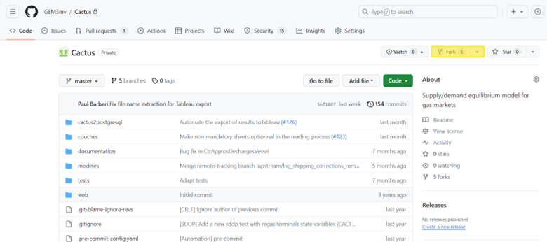

And clone the repo with your fork:
   - git clone https://github.tools.digital.engie.com/%YOUR_GAIA%/Cactus.git

where %YOUR_GAIA% is your ENGIE's ID.

Python virtual environment
^^^^^^^^^^^^^^^^^^^^^^^^^^

Add the following paths to the PATH environment variable:
  - C:\\Python38\\
  - C:\\Python38\\Scripts

To do so, press :kbd:`⊞ Win` and search Edit environment variables for your account, look for the variable called PATH, edit it and add the two paths.

.. note::
   The following instructions are explaining a way to manage virtual environments, but fell free to use any other way (direct management within an IDE, pipenv/poetry tools, etc.) that you are comfortable to use, as soon as you use the requirements.txt file.

Open then a terminal (press :kbd:`⊞ Win` and search cmd). Then write cd C:\\Data\\workspace. Install virtualenv by running:

  - pip install virtualenv virtualenvwrapper-win
  - python -m pip install --upgrade pip
  - pip install setuptools -U

Create a new environment and deactivate it directly.
   - mkvirtualenv -p 3.8 -a C:\\Data\\workspace\\cactus cactus38
   - deactivate

Please copy and paste the following code at the end of the file activate.bat. Such file is located here normally C:\\Users\\YOUR_GAIA_ID\\Envs\\cactus38\\Scripts.

  - REM Define specific environment variables for Cactus project
  - set ORIGIN_PATH=%PATH%
  - set GAMSDIR=C:\\GAMS\\45\\
  - set PATH=%PATH%;%GAMSDIR%

Open then the deactivate.bat script and copy paste at the end of the file the following information:

   - REM Remove specific environment variables for Cactus project
   - set GAMSDIR=
   - set PATH=%ORIGIN_PATH%

You can now open your interpreter and activate your virtual environment by pressing:

*workon cactus38*

Let's install the packages, you can enter the following commands:
   - pip install -r C:\\Data\\workspace\\cactus\\requirements.txt 
   - pip install -e C:\\Data\\workspace\\Cactus

Tableau/Postgres
^^^^^^^^^^^^^^^^

**Create a local database**
Open pgAdmin and click Add New Server:

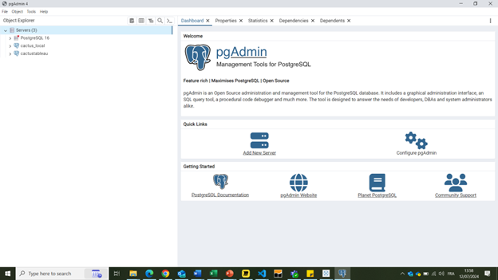

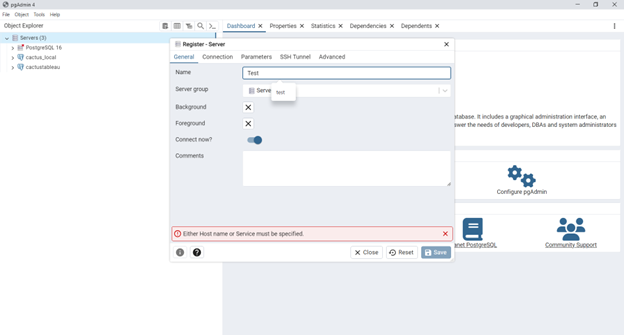

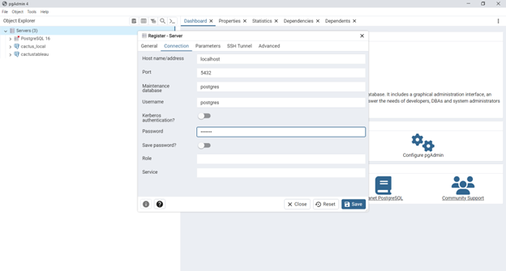

Save

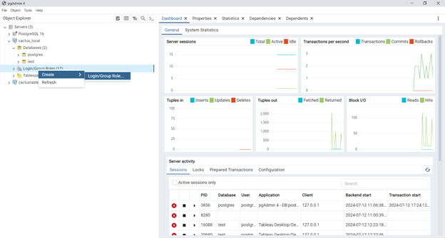

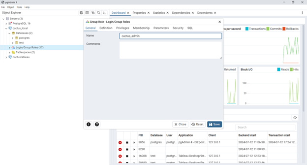

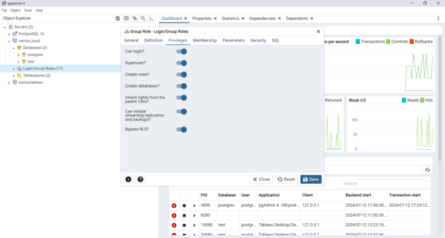

Save, then do the same with cactus_rw

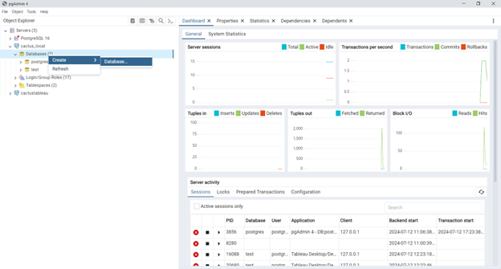

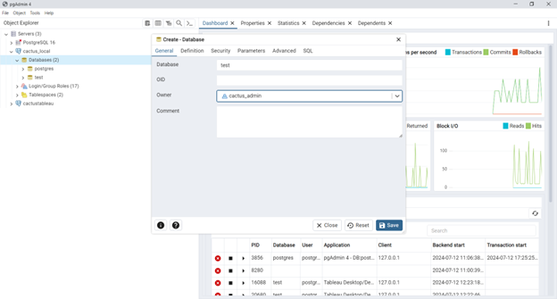

Save

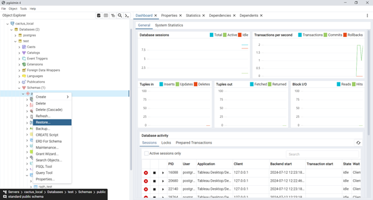

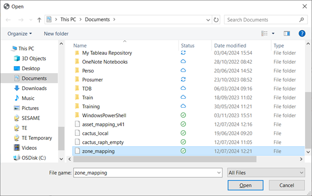

Do this for both `zone_mapping <https://engie.sharepoint.com/sites/CactusS-ImpactTeam/Shared Documents/Impact Team/Cactus 2024/Training/Wiki/zone_mapping>`_ and `asset_mapping_v41 <https://engie.sharepoint.com/sites/CactusS-ImpactTeam/Shared Documents/Impact Team/Cactus 2024/Training/Wiki/asset_mapping_v41>`_ files.

Congratulations, your local database is created and it contains the minimum information to connect to the Tableau Dashboard.

**Connect to the shared database**

*Info*:
host: dtcoprdpgs016l.pld.infrasys16.com
Port: 5432
DB: cactustableau
logins: user cactus_rw          
password : rZKLcqrrzs5kLFNnzHT8LwQXr5zfUSUW

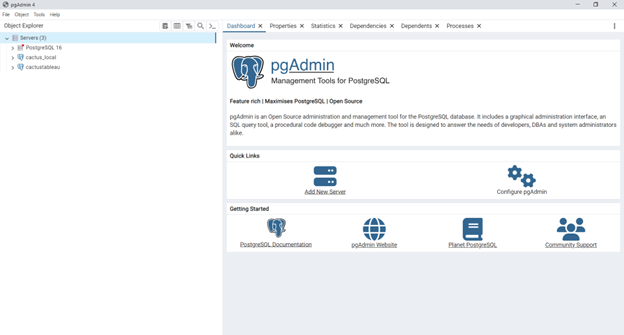

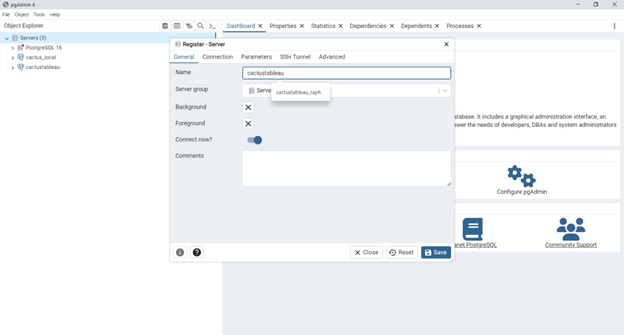

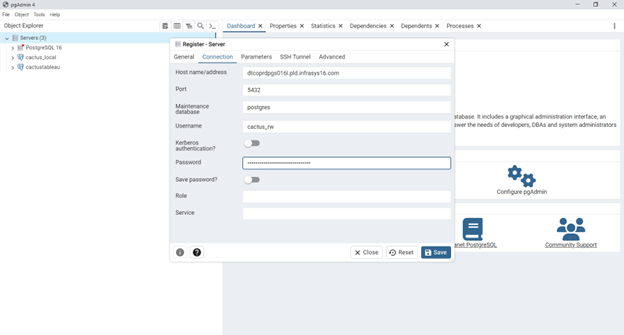

Save
Congratulations, you have access to the shared database!

**Link Tableau with a database**

In Tableau, go to Data (banner at the top) and then New Data Source, select postgresql

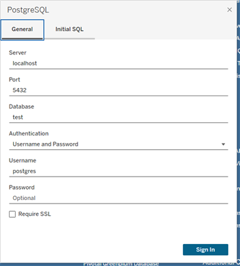

Fill in the information and then sign in. Once this is done, we can now view a table from the database in Tableau as follows (Go to Data Source (bottom left)):

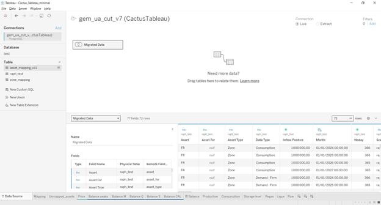

Click on Migrated Data < Open

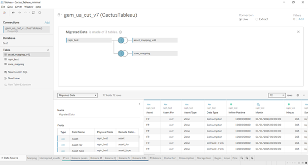

Drag & Drop the table (here for example raph_test) that is on the left in the Table part to the Migrated Data. (Be careful, here you have to place the new table on top of the old one). At this step of the installation process you shouldn't have yet a table. Please come back to this step just after testing a run.

Test
----

In order to check that your installation is working properly, we will do the following test:
  1. Edit the file config.json that is located in the cactus2postgresql with the information of your local database.
  2. Activate your environment (workon cactus38).
  3. Create an empty folder here: C:\\GAMS\\CactusResults
  4. Launch the following command at the root of Cactus repo (where the main.py file is located): *python main.py -d "documentation/installations" -i "example.xlsx" -c "cats.xml" -o "output.xlsx" --e*
  5. When the run is done, a pop-up window should appear and you can click on Start importing file. 

Once it's done, you can open Tableau, link the newly created table and visualize the results. If everything went well, in the balance CAL sheet you should see the following table:

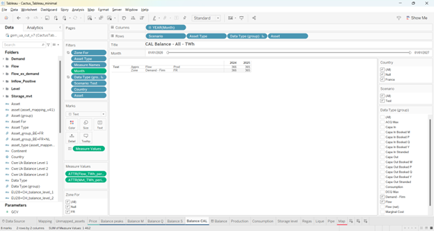
