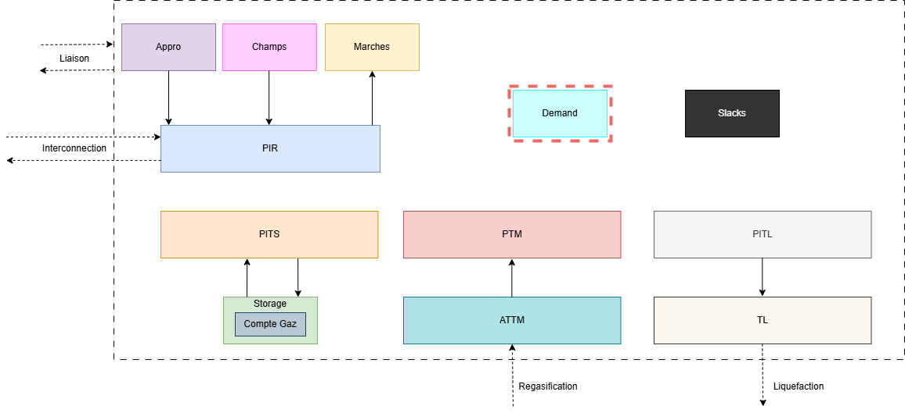

:orphan:  .. NOT DELETE: Avoid warning about document not being included in any toctree

.. role:: underline
    :class: underline

Demand
======

.. contents::
    :depth: 2
    :local:

General introduction
--------------------

The demand models are used to define the load of each zone. Three different demand models are currently available in Cactus :

     - `Uninterruptible demand (DemandeNormale)`: it corresponds to the load that must be satisfied by the system,
     - `Interruptible demand (DemandeInter)`: it corresponds to the load that can be shedded at a given price.
     - `Demand shift (DemandeTransit)`: it allows the user to shift a demand from one PIR to another. **This model is deprecated and the model is not instantiated by this sheet.**

In the global picture of the object available in Cactus we'll focus on the following ones:

Technical description and model assumptions
-------------------------------------------

Demand satisfaction (for uninterruptible and interruptible demands) is included in the model in the balance equation between inflows and outflows for a given zone and period:

.. math:: \text{Outflow} = \text{Demand} + \text{Demand Inter} - \text{Effacement} + \ldots

Where,

     - **Demand** is the uninterruptible demand value defined in the DemandeNormale sheet
     - **Demand Inter** is the interruptible demand value defined in the DemandeInter sheet. 
     - The **Effacement** variable is bounded by the **Demand Inter** parameter, and penalized in the objective function by the parameter `ClientInterruptiblePrixEffacement`: 

.. math:: ObjFunction += \text{Effacement} \times \text{ClientInterruptiblePrixEffacement}

For a more detailed view of the balance equation at the zone level, the user can look at the documentation of :ref:`Zone<target_model_overview_module>` model, and at the equation `CtrBilanZone(z, p)` in the ModeleGAMS.gms file.

Excel input sheets
------------------

.. _target_demand_normale:
.. admonition:: DemandeNormale
    :class: error

    *Sheet description*: Definition of the **daily** non interruptible demand by zone on each time period. This sheet is dynamic in the sense that you must add the periods defined in your model as columns.

    .. list-table::
        :widths: 25 25 25 25 25
        :header-rows: 1

        * - Nom
          - Zone
          - Periode1
          - Periode2
          - ...
        * - DemandName1 (e.g: BA)
          - ZoneName1 (e.g: BA)
          - 01/01/2020 (e.g: 12,032)
          - 01/02/2020 (e.g: 10,000)
          - ...

    ⚙️ Nom
        * *Description:* Unique name of the demand. Can also use the same name as the zone.
        * *Validity:* String

    ⚙️ Zone
        * *Description:* Name of the zone where the demand is located.
        * *Validity:* Must be part of the zones defined in the :ref:`Zones<target_zones>` sheet.

    ⚙️ Periode1, Periode2, ...
        * *Description:* Demand value for each period. Warning, this demand is in MWh/day and will be multiplied by the number of days in the period.
        * *Unit:* MWh/day
        * *Validity:* Float. The periods must be defined in the :ref:`Horizon<target_horizon>` sheet.

.. _target_demand_inter:
.. admonition:: DemandeInter
    :class: error

    *Sheet description*: Definition of the **daily** interruptible demand by zone on each time period. This sheet is dynamic in the sense that you must add the periods defined in your model as columns.

    .. list-table::
        :widths: 25 25 25 25 25 25
        :header-rows: 1

        * - Entete
          - Nom
          - Zone
          - Periode1
          - Periode2
          - ...
        * - Flag1 (e.g: Prix Inter Reel)
          - DemandName1 (e.g: FR_CSP_G47_C44)
          - NomZone1 (e.g: FR)
          - 01/01/2020 (e.g: 13.19)
          - 01/02/2020 (e.g: 13.28)
          - ...

    ⚙️ Entete
        * *Description:* Each interruptible demand object is defined by a set of two timeseries : the demand itself, and an interruption price series. This field is used to define to which parameter the timeseries defined in the next columns corresponds to:
            * Demande Inter
            * Prix Inter Optim
            * Prix Inter Reel (Not used anymore, but can be found in old dataset)
        * *Validity:* String

    ⚙️ Nom
        * *Description:* Unique name of the demand object.
        * *Validity:* String

    ⚙️ Zone
        * *Description:* Name of the zone where the demand is located.
        * *Validity:* Must be part of the zones defined in the :ref:`Zones<target_zones>` sheet.

    ⚙️ Periode1, Periode2, ...
        * *Description:* Demand value for each period. Warning, this demand is in MWh/day and will be multiplied by the number of days in the period.
        * *Unit:* MWh/day
        * *Validity:* Float. The periods must be defined in the :ref:`Horizon<target_horizon>` sheet.

.. _target_demand_transit:
.. admonition:: DemandeTransit - DEPRECATED
    :class: error

    *Sheet description*: This sheet controls the global **daily** demand that can be shifted from one PIR to another by period. This sheet is dynamic in the sense that you must add the periods defined in your model as columns. Please note that this model is deprecated and the equations generated and associated results should be double checked before any analysis.

    .. list-table::
        :widths: 25 25 25 25 25 25
        :header-rows: 1

        * - Nom
          - PIR Amont
          - PIR Aval
          - Periode1
          - Periode2
          - ...
        * - Name1
          - UpstreamPIR1
          - DownstreamPIR1
          - Value11
          - Value21
          - ...

    ⚙️ Nom
        * *Description:* Unique name of the demand.
        * *Validity:* String

    ⚙️ PIR Amont
        * *Description:* Name of the upstream PIR.
        * *Validity:* String. The PIR must be defined in the :ref:`PIR<target_pir>` sheet.

    ⚙️ PIR Aval
        * *Description:* Name of the downstream PIR.
        * *Validity:* String. The PIR must be defined in the :ref:`PIR<target_pir>` sheet.

    ⚙️ Periode1, Periode2, ...
        * *Description:* Demand value for each period. Warning, this demand is in MWh/day and will be multiplied by the number of days in the period.
        * *Unit:* MWh/day
        * *Validity:* Float. The periods must be defined in the :ref:`Horizon<target_horizon>` sheet.

