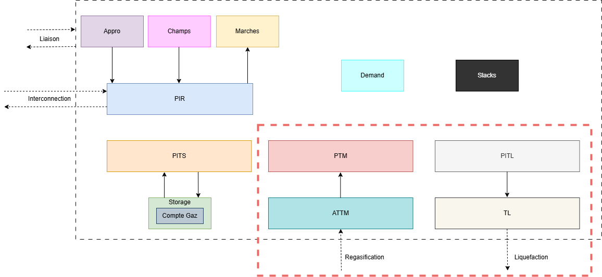
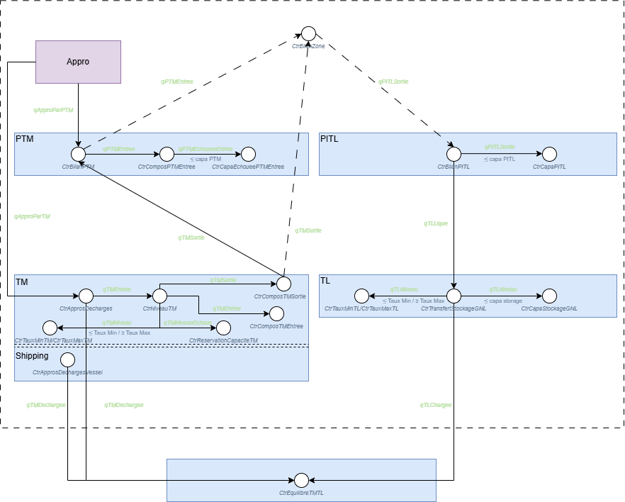

:orphan:  .. NOT DELETE: Avoid warning about document not being included in any toctree

.. _target_lng_module:
LNG
===

General introduction
--------------------

The LNG (Liquefied Natural Gas) is becoming more and more present in the balance of the gas systems. The LNG model in Cactus allows the user to define the regasification and liquefaction terminals and their characteristics (mainly capacity and costs). In the global picture of the object available in Cactus we'll focus on the following ones:

The objects in this module goes by pairs, one for the regasification (resp. liquefaction) terminal and one for the point associated to it. Hence, an ATTM will be associated to a PTM (that could be linked to multiples ATTM), and a TL will be associated to a PITL (that could be linked to multiples TL).

Technical description and model assumptions
-------------------------------------------

Liquefaction process
^^^^^^^^^^^^^^^^^^^^
With the LNG model we only model the liquefaction and regasification processes but don't model the shipping part (that is modelled in the :ref:`Shipping<target_shipping_module>` module). Hence, it is assume to be a black box that will deliver the gas from the network (PITL) to the liquefaction terminal and then be regasified by a TM elsewhere. The PITL and TL are link by an equation (`CtrBilanPITL`) which makes sure that all the liquefied gas that needs to be liquefied from the network (PITL) is delivered to the associated terminals. As a reminder, the PITL are involved in the `CtrBilanZone` equation which is how this object is linked to the zone.

Here is a summary of the main equations involved in the liquefaction process (at the PITL level):

.. math:: \text{Liquefied quantity (PITL)} \leq \text{Liquefaction capacity (PITL)} \times \text{Period}

We also have the link between the terminal (TL) and the PITL:

.. math:: \text{Liquefied quantity (PITL)} = \sum\text{Liquefied quantity (TL)} \times \text{Efficiency (TL)}

And finally, the liquefaction terminal works as follow. It's a storage that has a capacity for loading liquefied gas and sending it to other TL:

.. math:: \text{Liquefied quantity (TL)} \leq \text{Liquefaction capacity (TL)} \times \text{Period}

Where the liquefaction capacity is a mix between the capacity defined by the user (*capacité souscrite*) and the added capacity that can be contracted by the model (*capacité dispo*). We also have a similar upper bound for the total quantity (in MWh) that can be stored at the terminal:

.. math:: \text{Liquefied quantity (TL)} \leq \text{Liquefaction capacity (TL)}

Where here the total capacity of the storage is fixed by the user. And finally, there is a flow equation that makes sure that the balance is respected at the terminal level.

.. math:: \text{Liquefied gas level (TL)}_{t} = \text{Liquefied gas level (TL)}_{t-1} + \text{Liquefied quantity (TL)}_{t} - \text{Liquefied sent to other terminals (TL)}_{t}

Finally, the `CtrEquilibreTMTL` equation makes sure that everything that is liquefied is regasified (at the whole network level):

.. math:: \sum\text{Liquefied sent to other terminals (TL)} = \sum\text{Regasified from other terminals (TM)}

Regasification process
^^^^^^^^^^^^^^^^^^^^^^
Once the gas is at the regasification terminal (TM), it still needs to be re-injected into the network. The regasification terminal is a storage that has a capacity for loading liquefied gas and the one from the prod:

.. _target_ctr_bilan_tm:
.. math:: \text{Regasified quantity (TM)} = \text{Regasification capacity from other terminals (TM)} + \text{Prod to TM}

And,

.. math:: \text{Regasified level (TM)}_t \leq \text{Regasification level (TM)}_{t-1} + \text{Regasified quantity in (TM)}_t - \text{Regasified quantity out (TM)}_t

And obviously there are some constraints on the capacity of what can go in and out of the terminal:

.. math:: \text{Regasified quantity in/out (TM)} \leq \text{Regasification capacity in/ou (TM)} \times \text{Period}

Where the regasification capacity is a mix between the capacity defined by the user (*capacité souscrite*) and the added capacity that can be contracted by the model (*capacité dispo*). We also have a similar upper bound for the total quantity (in MWh) that can be stored at the terminal:

.. math:: \text{Regasified level (TM)} \leq \text{Regasification capacity (TM)}

Where here the total capacity of the storage is again a mix between the capacity defined by the user (*capacité souscrite*) and the added capacity that can be contracted by the model (*capacité dispo*). There are also possibilities here to constraint the level of the storage of the TM by putting tunnels:

.. math:: \text{Regasification level min (TM)} \leq \text{Regasified level (TM)} \leq \text{Regasification level max (TM)}

Finally, the TM is linked to the PTM (`CtrBilanPTM`) via the Regasified quantity that goes out of the TM (and thus in the PTM):

.. _target_ctr_bilan_ptm:
.. math:: \text{Regasified quantity (PTM)} = \text{Regasified quantity out (TM)} \times \text{Efficiency (TM)} + \sum\text{Prod to PTM} \times \text{Efficiency (PTM)}

As a reminder, the PTM are involved in the `CtrBilanZone` equation which is how this object is linked to the zone. Be careful here because both the TM and the PTM are linked to the zone. The production can directly go in the TM or in the PTM. Yet, only the PTM is involved in the `CtrBilanZone` equation, which means that in order to fulfill the demand of gas, it must go through both the TM and then the PTM.

Here is a detailed schematics of the model with the associated variables and equations:

Finally, the objective function is impacted as follow:

.. math::
    \begin{align*}
        ObjFunction +&= \sum \text{Regasified quantity (PTM)} \times \text{Regasified price (PTM)} \\
                    &+ \sum \text{Capa TM} \times \text{Capa price TM} \\
                    &+ \sum \text{Capa PTM} \times \text{Capa price PTM} \\
                    &+ \sum \text{Liquefied quantity (TL)} \times \text{Liquefied price (TL)} \\
                    &+ \sum \text{Liquefied capacity (TL)} \times \text{Capa price (TL)} \\
    \end{align*}

.. contents::
    :depth: 2
    :local:

Excel input sheets
------------------

Regasification terminal
^^^^^^^^^^^^^^^^^^^^^^^

.. _target_ptm:
.. admonition:: PTM
    :class: error

    *Sheet Description*: Point Terminal Méthanier (PTM)

    .. list-table::
        :widths: 25 25 25 25 25 25 25 25 25 25 25 25 25 25 25 25 25 25 25 25 25 25 25 25 25 25 25 25 25 25 25 25 25 25 25 25 25 25 25 25 25 25 25 25 25 25 25 25
        :header-rows: 1

        * - NomPTM
          - Zone
          - Capacité souscrite en entrée [MWh/j]
          - Capacité dispo en entrée [MWh/j]
          - Part de la capacité d'entrée à mettre de côté pour le court terme [%]
          - Mois démarrage capas annuelles
          - Début modélisation capas annuelles entrée
          - Début modélisation capas trimestrielles entrée
          - Début modélisation capas mensuelles entrée
          - Début modélisation capas journalières entrée
          - Fin modélisation capas annuelles entrée
          - Fin modélisation capas trimestrielles entrée
          - Fin modélisation capas mensuelles entrée
          - Fin modélisation capas journalières entrée
          - Tarif Capacite entree [€/MWh/j]
          - Tarif Variable entree [€/MWh]
          - Gas-in-kind entrée [%]
          - Multiplicateur trimestriel Tarif Capa d'entrée
          - Multiplicateur mensuel Tarif Capa d'entrée
          - Multiplicateur journalier Tarif Capa d'entrée
          - Facteur saisonnier trimestriel entrée Q1
          - Facteur saisonnier trimestriel entrée Q2
          - Facteur saisonnier trimestriel entrée Q3
          - Facteur saisonnier trimestriel entrée Q4
          - Facteur saisonnier mensuel entrée Janvier
          - Facteur saisonnier mensuel entrée Février
          - Facteur saisonnier mensuel entrée Mars
          - Facteur saisonnier mensuel entrée Avril
          - Facteur saisonnier mensuel entrée Mai
          - Facteur saisonnier mensuel entrée Juin
          - Facteur saisonnier mensuel entrée Juillet
          - Facteur saisonnier mensuel entrée Août
          - Facteur saisonnier mensuel entrée Septembre
          - Facteur saisonnier mensuel entrée Octobre
          - Facteur saisonnier mensuel entrée Novembre
          - Facteur saisonnier mensuel entrée Décembre
          - Facteur saisonnier journalier entrée Janvier
          - Facteur saisonnier journalier entrée Février
          - Facteur saisonnier journalier entrée Mars
          - Facteur saisonnier journalier entrée Avril
          - Facteur saisonnier journalier entrée Mai
          - Facteur saisonnier journalier entrée Juin
          - Facteur saisonnier journalier entrée Juillet
          - Facteur saisonnier journalier entrée Août
          - Facteur saisonnier journalier entrée Septembre
          - Facteur saisonnier journalier entrée Octobre
          - Facteur saisonnier journalier entrée Novembre
          - Facteur saisonnier journalier entrée Décembre
        * - Name of the PTM (ex: Amber Grid | LT | Klaipeda LNG)
          - Zone (ex: LT)
          - Capacity subscribed at entry [MWh/d] (ex: Entree_Amber Grid | LT | Klaipeda LNG)
          - Capacity available at entry [MWh/d] (ex: AddEntree_Amber Grid | LT | Klaipeda LNG)
          - Share of the entry capacity to be set aside for the short term [%] (ex: 0)
          - Month of start of annual capacities (ex: 10)
          - Start of annual capacities modelling at entry (ex: 01/01/2020)
          - Start of quarterly capacities modelling at entry (ex: 01/01/2020)
          - Start of monthly capacities modelling at entry (ex: 01/01/2020)
          - Start of daily capacities modelling at entry (ex: 01/01/2020)
          - End of annual capacities modelling at entry (ex: 01/01/2100)
          - End of quarterly capacities modelling at entry (ex: 01/01/2100)
          - End of monthly capacities modelling at entry (ex: 01/01/2100)
          - End of daily capacities modelling at entry (ex: 01/01/2100)
          - Entry capacity tariff [€/MWh/d] (ex: 0.026191781)
          - Variable entry tariff [€/MWh] (ex: 0)
          - Gas-in-kind entry [%] (ex: 0)
          - Quarterly entry capacity tariff multiplier (ex: 1.25)
          - Monthly entry capacity tariff multiplier (ex: 1.5)
          - Daily entry capacity tariff multiplier (ex: 2.25)
          - Quarterly seasonal factor entry Q1 (ex: 1)
          - Quarterly seasonal factor entry Q2 (ex: 1)
          - Quarterly seasonal factor entry Q3 (ex: 1)
          - Quarterly seasonal factor entry Q4 (ex: 1)
          - Monthly seasonal factor entry January (ex: 1)
          - Monthly seasonal factor entry February (ex: 1)
          - Monthly seasonal factor entry March (ex: 1)
          - Monthly seasonal factor entry April (ex: 1)
          - Monthly seasonal factor entry May (ex: 1)
          - Monthly seasonal factor entry June (ex: 1)
          - Monthly seasonal factor entry July (ex: 1)
          - Monthly seasonal factor entry August (ex: 1)
          - Monthly seasonal factor entry September (ex: 1)
          - Monthly seasonal factor entry October (ex: 1)
          - Monthly seasonal factor entry November (ex: 1)
          - Monthly seasonal factor entry December (ex: 1)
          - Daily seasonal factor entry January (ex: 1)
          - Daily seasonal factor entry February (ex: 1)
          - Daily seasonal factor entry March (ex: 1)
          - Daily seasonal factor entry April (ex: 1)
          - Daily seasonal factor entry May (ex: 1)
          - Daily seasonal factor entry June (ex: 1)
          - Daily seasonal factor entry July (ex: 1)
          - Daily seasonal factor entry August (ex: 1)
          - Daily seasonal factor entry September (ex: 1)
          - Daily seasonal factor entry October (ex: 1)
          - Daily seasonal factor entry November (ex: 1)
          - Daily seasonal factor entry December (ex: 1)

    ⚙️ NomPTM
        * *Description:* Name of the PTM.
        * *Unit:* *None*
        * *Validity:* String
    
    ⚙️ Zone
        * *Description:* Zone.
        * *Unit:* *None*
        * *Validity:* String. It must refer to a value defined in the :ref:`Zones<target_zones>` sheet.

    ⚙️ Capacité souscrite en entrée [MWh/j]
        * *Description:* Capacity subscribed at entry.
        * *Unit:* MWh/d
        * *Validity:* Float or String. If String, then it must refer to a value defined in the :ref:`CapaParPdt<target_capa_par_pdt>` sheet.

    ⚙️ Capacité dispo en entrée [MWh/j]
        * *Description:* Capacity available at entry. The model is free to chose between 0 and this capacity for increasing the already existing one.
        * *Unit:* MWh/d
        * *Validity:* Float or String. If String, then it must refer to a value defined in the :ref:`CapaParPdt<target_capa_par_pdt>` sheet.

    ⚙️ Part de la capacité d'entrée à mettre de côté pour le court terme [%]
        * *Description:* Share of the entry capacity to be set aside for the short term.
        * *Unit:* Percentage
        * *Validity:* Float

    ⚙️ Mois démarrage capas annuelles
        * *Description:* Month of start of annual capacities.
        * *Unit:* *None*
        * *Validity:* Integer

    ⚙️ Début modélisation capas annuelles entrée
        * *Description:* Start of annual capacities modelling at entry.
        * *Unit:* *None*
        * *Validity:* Date

    ⚙️ Début modélisation capas trimestrielles entrée
        * *Description:* Start of quarterly capacities modelling at entry.
        * *Unit:* *None*
        * *Validity:* Date

    ⚙️ Début modélisation capas mensuelles entrée
        * *Description:* Start of monthly capacities modelling at entry.
        * *Unit:* *None*
        * *Validity:* Date

    ⚙️ Début modélisation capas journalières entrée
        * *Description:* Start of daily capacities modelling at entry.
        * *Unit:* *None*
        * *Validity:* Date

    ⚙️ Fin modélisation capas annuelles entrée
        * *Description:* End of annual capacities modelling at entry.
        * *Unit:* *None*
        * *Validity:* Date

    ⚙️ Fin modélisation capas trimestrielles entrée
        * *Description:* End of quarterly capacities modelling at entry.
        * *Unit:* *None*
        * *Validity:* Date

    ⚙️ Fin modélisation capas mensuelles entrée
        * *Description:* End of monthly capacities modelling at entry.
        * *Unit:* *None*
        * *Validity:* Date

    ⚙️ Fin modélisation capas journalières entrée
        * *Description:* End of daily capacities modelling at entry.
        * *Unit:* *None*
        * *Validity:* Date

    ⚙️ Tarif Capacite entree [€/MWh/j]
        * *Description:* Entry capacity tariff.
        * *Unit:* €/MWh/d
        * *Validity:* Float

    ⚙️ Tarif Variable entree [€/MWh]
        * *Description:* Variable entry tariff.
        * *Unit:* €/MWh
        * *Validity:* Float

    ⚙️ Gas-in-kind entrée [%]
        * *Description:* Gas-in-kind entry.
        * *Unit:* Percentage
        * *Validity:* Float

    ⚙️ Multiplicateur trimestriel Tarif Capa d'entrée
        * *Description:* Quarterly entry capacity tariff multiplier.
        * *Unit:* *None*
        * *Validity:* Float

    ⚙️ Multiplicateur mensuel Tarif Capa d'entrée
        * *Description:* Monthly entry capacity tariff multiplier.
        * *Unit:* *None*
        * *Validity:* Float

    ⚙️ Multiplicateur journalier Tarif Capa d'entrée
        * *Description:* Daily entry capacity tariff multiplier.
        * *Unit:* *None*
        * *Validity:* Float

    ⚙️ Facteur saisonnier trimestriel entrée Q1
        * *Description:* Quarterly seasonal factor entry Q1.
        * *Unit:* *None*
        * *Validity:* Float

    ⚙️ Facteur saisonnier trimestriel entrée Q2
        * *Description:* Quarterly seasonal factor entry Q2.
        * *Unit:* *None*
        * *Validity:* Float

    ⚙️ Facteur saisonnier trimestriel entrée Q3
        * *Description:* Quarterly seasonal factor entry Q3.
        * *Unit:* *None*
        * *Validity:* Float

    ⚙️ Facteur saisonnier trimestriel entrée Q4
        * *Description:* Quarterly seasonal factor entry Q4.
        * *Unit:* *None*
        * *Validity:* Float

    ⚙️ Facteur saisonnier mensuel entrée Janvier
        * *Description:* Monthly seasonal factor entry January.
        * *Unit:* *None*
        * *Validity:* Float

    ⚙️ Facteur saisonnier mensuel entrée Février
        * *Description:* Monthly seasonal factor entry February.
        * *Unit:* *None*
        * *Validity:* Float

    ⚙️ Facteur saisonnier mensuel entrée Mars
        * *Description:* Monthly seasonal factor entry March.
        * *Unit:* *None*
        * *Validity:* Float

    ⚙️ Facteur saisonnier mensuel entrée Avril
        * *Description:* Monthly seasonal factor entry April.
        * *Validity:* Float

    ⚙️ Facteur saisonnier mensuel entrée Mai
        * *Description:* Monthly seasonal factor entry May.
        * *Unit:* *None*

    ⚙️ Facteur saisonnier mensuel entrée Juin
        * *Description:* Monthly seasonal factor entry June.
        * *Unit:* *None*
        * *Validity:* Float
        * *Description:* Monthly seasonal factor entry July.
        * *Unit:* *None*
        * *Validity:* Float

    ⚙️ Facteur saisonnier mensuel entrée Août
        * *Description:* Monthly seasonal factor entry August.
        * *Unit:* *None*
        * *Validity:* Float

    ⚙️ Facteur saisonnier mensuel entrée Septembre
        * *Description:* Monthly seasonal factor entry September.
        * *Unit:* *None*
        * *Validity:* Float

    ⚙️ Facteur saisonnier mensuel entrée Octobre
        * *Description:* Monthly seasonal factor entry October.
        * *Unit:* *None*
        * *Validity:* Float

    ⚙️ Facteur saisonnier mensuel entrée Novembre
        * *Description:* Monthly seasonal factor entry November.
        * *Validity:* Float

    ⚙️ Facteur saisonnier mensuel entrée Décembre
        * *Description:* Monthly seasonal factor entry December.
        * *Validity:* Float

    ⚙️ Facteur saisonnier journalier entrée Janvier
        * *Description:* Daily seasonal factor entry January.
        * *Unit:* *None*
        * *Validity:* Float

    ⚙️ Facteur saisonnier journalier entrée Février
        * *Description:* Daily seasonal factor entry February.
        * *Unit:* *None*
        * *Validity:* Float

    ⚙️ Facteur saisonnier journalier entrée Mars
        * *Description:* Daily seasonal factor entry March.
        * *Unit:* *None*
        * *Validity:* Float

    ⚙️ Facteur saisonnier journalier entrée Avril
        * *Description:* Daily seasonal factor entry April.
        * *Unit:* *None*
        * *Validity:* Float

    ⚙️ Facteur saisonnier journalier entrée Mai
        * *Description:* Daily seasonal factor entry May.
        * *Unit:* *None*
        * *Validity:* Float

    ⚙️ Facteur saisonnier journalier entrée Juin
        * *Description:* Daily seasonal factor entry June.
        * *Validity:* Float

    ⚙️ Facteur saisonnier journalier entrée Juillet
        * *Description:* Daily seasonal factor entry July.
        * *Unit:* *None*
        * *Validity:* Float

    ⚙️ Facteur saisonnier journalier entrée Août
        * *Description:* Daily seasonal factor entry August.
        * *Unit:* *None*
        * *Validity:* Float

    ⚙️ Facteur saisonnier journalier entrée Septembre
        * *Description:* Daily seasonal factor entry September.
        * *Unit:* *None*
        * *Validity:* Float

    ⚙️ Facteur saisonnier journalier entrée Octobre
        * *Description:* Daily seasonal factor entry October.
        * *Unit:* *None*
        * *Validity:* Float

    ⚙️ Facteur saisonnier journalier entrée Novembre
        * *Description:* Daily seasonal factor entry November.
        * *Unit:* *None*
        * *Validity:* Float

    ⚙️ Facteur saisonnier journalier entrée Décembre
        * *Description:* Daily seasonal factor entry December.
        * *Unit:* *None*
        * *Validity:* Float

.. _target_attm:

.. admonition:: ATTM
    :class: error

    *Sheet Description*: This sheet contains the information about the terminals. It's the place where you can define the regasification terminals and their characteristics (mainly capacity and costs).

    .. list-table::
        :widths: 25 25 25 25 25 25 25 25 25 25 25 25 25 25 25 25 25 25 25 25 25 25 25
        :header-rows: 1

        * - NomTerminal
          - LNG node
          - PTM
          - Durée du bandeau (j)
          - Mois de démarrage
          - Capacité de déchargement (MWh/j)
          - Capacité de regazéification (MWh/an)
          - Capacité de stockage (MWh)
          - % Capacités échouées [0;100]
          - Tarif variable déchargement - capacités échouées (€/MWh)
          - Tarif variable stock - capacités échouées (€/MWh)
          - Tarif variable regaz - capacités échouées (€/MWh)
          - Tarif capa regaz - souscription annuelle (€/(MWh/j)/j)
          - Tarif capa stock - souscription annuelle (€/MWh/j)
          - Tarif variable déchargement - souscription annuelle (€/MWh)
          - Tarif variable stock - souscription annuelle (€/MWh)
          - Tarif variable regaz - souscription annuelle (€/MWh)
          - Tarif capa regaz - souscription périodique (€/(MWh/j)/j)
          - Tarif capa stock - souscription périodique (€/MWh/j)
          - Tarif variable déchargement - souscription périodique (€/MWh)
          - Tarif variable stock - souscription périodique (€/MWh)
          - Tarif variable regaz - souscription périodique (€/MWh)
          - % Gaz carburant [0;100]
        * - Terminal Name (ex: Klaipeda LNG)
          - LNG node (ex: LNG_LT)
          - PTM (ex: Amber Grid | LT | Klaipeda LNG)
          - Duration of the band (days) (ex: 0)
          - Start month (ex: 10)
          - Unloading capacity (MWh/d) (ex: 1,000,000)
          - Regasification capacity (MWh/y) (ex: 44,496,117)
          - Storage capacity (MWh) (ex: 1,169,294)
          - % Failed capacities [0;100] (ex: Pourcent_CapaEchouee_Klaipeda LNG)
          - Variable unloading tariff - failed capacities (€/MWh) (ex: 0)
          - Variable storage tariff - failed capacities (€/MWh) (ex: 0)
          - Variable regasification tariff - failed capacities (€/MWh) (ex: 0.10)
          - Regasification capacity tariff - annual subscription (€/(MWh/d)/d) (ex: 0)
          - Storage capacity tariff - annual subscription (€/MWh/d) (ex: 0)
          - Variable unloading tariff - annual subscription (€/MWh) (ex: 0)
          - Variable storage tariff - annual subscription (€/MWh) (ex: 0)
          - Variable regasification tariff - annual subscription (€/MWh) (ex: 0.10)
          - Regasification capacity tariff - periodic subscription (€/(MWh/d)/d) (ex: 0)
          - Storage capacity tariff - periodic subscription (€/MWh/d) (ex: 0)
          - Variable unloading tariff - periodic subscription (€/MWh) (ex: 0)
          - Variable storage tariff - periodic subscription (€/MWh) (ex: 0)
          - Variable regasification tariff - periodic subscription (€/MWh) (ex: 0.10)
          - % Fuel gas [0;100] (ex: 0.9)

    ⚙️ NomTerminal
        * *Description:* Name of the terminal.
        * *Unit:* *None*
        * *Validity:* String

    ⚙️ LNG node
        * *Description:* LNG node.
        * *Unit:* *None*
        * *Validity:* String. It must refer to a value defined in the :ref:`LNGNodes<target_lng_nodes>` sheet.

    ⚙️ PTM
        * *Description:* Name of the PTM.
        * *Unit:* *None*
        * *Validity:* String. It must refer to a value defined in the :ref:`PTM<target_ptm>` sheet.

    ⚙️ Durée du bandeau (j)
        * *Description:* Duration of the band (days).
        * *Unit:* Days
        * *Validity:* Integer

    ⚙️ Mois de démarrage
        * *Description:* Start month.
        * *Unit:* *None*
        * *Validity:* Integer

    ⚙️ Capacité de déchargement (MWh/j)
        * *Description:* Unloading capacity.
        * *Unit:* MWh/d
        * *Validity:* Float or String. If String, then it must refer to a value defined in the :ref:`CapaTMParDate<target_capa_tm_par_date>` sheet.

    ⚙️ Capacité de regazéification (MWh/an)
        * *Description:* Regasification capacity.
        * *Unit:* MWh/y
        * *Validity:* Float or String. If String, then it must refer to a value defined in the :ref:`CapaTMParDate<target_capa_tm_par_date>` sheet.

    ⚙️ Capacité de stockage (MWh)
        * *Description:* Storage capacity.
        * *Unit:* MWh
        * *Validity:* Float or String. If String, then it must refer to a value defined in the :ref:`CapaTMParDate<target_capa_tm_par_date>` sheet.

    ⚙️ % Capacités échouées [0;100]
        * *Description:* Percentage of the total capacity already booked at the beginning of the horizon.
        * *Unit:* Percentage
        * *Validity:* Float

    ⚙️ Tarif variable déchargement - capacités échouées (€/MWh)
        * *Description:* Variable unloading tariff - capacities already booked at the beginning of the horizon.
        * *Unit:* €/MWh
        * *Validity:* Float or String. If String, then it must refer to a value defined in the :ref:`TarifTMParDate<target_tarif_tm_par_date>` sheet.

    ⚙️ Tarif variable stock - capacités échouées (€/MWh)
        * *Description:* Variable storage tariff - capacities already booked at the beginning of the horizon.
        * *Unit:* €/MWh
        * *Validity:* Float or String. If String, then it must refer to a value defined in the :ref:`TarifTMParDate<target_tarif_tm_par_date>` sheet.

    ⚙️ Tarif variable regaz - capacités échouées (€/MWh)
        * *Description:* Variable regasification tariff - capacities already booked at the beginning of the horion.
        * *Unit:* €/MWh
        * *Validity:* Float or String. If String, then it must refer to a value defined in the :ref:`TarifTMParDate<target_tarif_tm_par_date>` sheet.

    ⚙️ Tarif capa regaz - souscription annuelle (€/(MWh/j)/j)
        * *Description:* Regasification capacity tariff - annual subscription.
        * *Unit:* €/(MWh/d)/d
        * *Validity:* Float or String. If String, then it must refer to a value defined in the :ref:`TarifTMParDate<target_tarif_tm_par_date>` sheet.

    ⚙️ Tarif capa stock - souscription annuelle (€/MWh/j)
        * *Description:* Storage capacity tariff - annual subscription.
        * *Validity:* Float or String. If String, then it must refer to a value defined in the :ref:`TarifTMParDate<target_tarif_tm_par_date>` sheet.

    ⚙️ Tarif variable déchargement - souscription annuelle (€/MWh)
        * *Description:* Variable unloading tariff - annual subscription.
        * *Unit:* €/MWh

    ⚙️ Tarif variable stock - souscription annuelle (€/MWh)
        * *Description:* Variable storage tariff - annual subscription.
        * *Unit:* €/MWh
        * *Validity:* Float or String. If String, then it must refer to a value defined in the :ref:`TarifTMParDate<target_tarif_tm_par_date>` sheet.

    ⚙️ Tarif variable regaz - souscription annuelle (€/MWh)
        * *Description:* Variable regasification tariff - annual subscription.
        * *Unit:* €/MWh
        * *Validity:* Float or String. If String, then it must refer to a value defined in the :ref:`TarifTMParDate<target_tarif_tm_par_date>` sheet.

        * *Description:* Regasification capacity tariff - periodic subscription.
        * *Unit:* €/(MWh/d)/d
        * *Validity:* Float or String. If String, then it must refer to a value defined in the :ref:`TarifTMParDate<target_tarif_tm_par_date>` sheet.

    ⚙️ Tarif capa stock - souscription périodique (€/MWh/j)
        * *Unit:* €/MWh/d
        * *Validity:* Float or String. If String, then it must refer to a value defined in the :ref:`TarifTMParDate<target_tarif_tm_par_date>` sheet.

    ⚙️ Tarif variable déchargement - souscription périodique (€/MWh)
        * *Description:* Variable unloading tariff - periodic subscription.
        * *Unit:* €/MWh
        * *Validity:* Float or String. If String, then it must refer to a value defined in the :ref:`TarifTMParDate<target_tarif_tm_par_date>` sheet.

    ⚙️ Tarif variable stock - souscription périodique (€/MWh)
        * *Description:* Variable storage tariff - periodic subscription.
        * *Unit:* €/MWh
        * *Validity:* Float or String. If String, then it must refer to a value defined in the :ref:`TarifTMParDate<target_tarif_tm_par_date>` sheet.

    ⚙️ Tarif variable regaz - souscription périodique (€/MWh)
        * *Description:* Variable regasification tariff - periodic subscription.
        * *Unit:* €/MWh
        * *Validity:* Float or String. If String, then it must refer to a value defined in the :ref:`TarifTMParDate<target_tarif_tm_par_date>` sheet.

    ⚙️ % Gaz carburant [0;100]
        * *Description:* Percentage of the gas used to fuel the regasification process. Putting 0 will assume that all the liquid that has been received will be turned into gas. Putting 1 on the contrary will assumed that nothing will be received.
        * *Unit:* Percentage
        * *Validity:* Float

.. _target_RemplissageTMFinal:

.. admonition:: RemplissageTMFinal
    :class: error

    *Sheet Description*: This sheet contains the information about the final level of the regasification terminal.

    .. list-table::
        :widths: 25
        :header-rows: 1

        * - Name of the Terminal (ex: Klaipeda LNG)
        * - Value of the filling quantity at the end of the horizon (ex: 5 000 MWh)

.. _target_MaintenanceRegaz:

.. admonition:: MaintenanceRegaz
    :class: error

    *Sheet Description*: This sheet contains the information about the maintenance of the regasification terminal.

    .. list-table::
        :widths: 25 25 25 25 25
        :header-rows: 1

        * - NomTerminal
          - Direction
          - Debut
          - Fin	
          - Capa restante [MWh/j]
        * - Terminal Name (ex: Klaipeda LNG)
          - Direction (ex: Unloading)
          - Start (ex: 01/01/2020)
          - End (ex: 01/01/2020)
          - Remaining capacity [MWh/d] (ex: 0) 

    ⚙️ NomTerminal
        * *Description:* Name of the terminal.
        * *Unit:* *None*
        * *Validity:* String. It must refer to a value defined in the :ref:`ATTM<target_attm>` sheet.

    ⚙️ Direction
        * *Description:* Direction.
        * *Unit:* *None*
        * *Validity:* String. It must be either "Unloading" or "Send-out".

    ⚙️ Debut
        * *Description:* Start.
        * *Unit:* *None*
        * *Validity:* Date

    ⚙️ Fin
        * *Description:* End.
        * *Unit:* *None*
        * *Validity:* Date

    ⚙️ Capa restante [MWh/j]
        * *Description:* Remaining capacity.
        * *Unit:* MWh/d
        * *Validity:* Float

Liquefaction terminal
^^^^^^^^^^^^^^^^^^^^^

.. _target_Lique:

.. admonition:: Lique
    :class: error

    *Sheet Description*: This sheet contains the information about the terminals. It's the place where you can define the liquefaction terminals and their characteristics (mainly capacity and costs).

    .. list-table::
        :widths: 25 25 25 25 25 25 25 25 25 25 25 25
        :header-rows: 1

        * - Nom
          - LNG node
          - PITL
          - Capacité max de liquéfaction (MWh/j)
          - Capacité de stockage (MWh)
          - Capacité de chargement (MWh/j)
          - Capacité de liquéfaction FID (MWh/j)
          - Investissement autorisé {0,1}
          - CAPEX (€/MWh de capa de liquéfaction journalière)
          - OPEX variable (€/MWh liquéfié)
          - % Gaz carburant [0;100]
          - Durée de vie (années)
        * - Terminal Name (ex: Klaipeda LNG)
          - LNG node (ex: LNG_LT)
          - PITL (ex: Amber Grid | LT | Klaipeda LNG)
          - Maximum liquefaction capacity (MWh/d) (ex: 1,000,000)
          - Storage capacity (MWh) (ex: 1,169,294)
          - Loading capacity (MWh/d) (ex: 1,000,000)
          - FID liquefaction capacity (MWh/d) (ex: 500,000)
          - Authorized investment {0,1} (ex: 1)
          - CAPEX (€/MWh of daily liquefaction capacity) (ex: 100)
          - Variable OPEX (€/MWh liquefied) (ex: 0.10)
          - % Fuel gas [0;100] (ex: 0.9)
          - Lifetime (years) (ex: 20)

    ⚙️ Nom
        * *Description:* Name of the terminal.
        * *Unit:* *None*
        * *Validity:* String

    ⚙️ LNG node
        * *Description:* LNG node.
        * *Unit:* *None*
        * *Validity:* String. It must refer to a value defined in the :ref:`LNGNodes<target_lng_nodes>` sheet.

    ⚙️ PITL
        * *Description:* Name of the PITL.
        * *Unit:* *None*
        * *Validity:* String. It must refer to a value defined in the :ref:`PITL<target_pitl>` sheet.

    ⚙️ Capacité max de liquéfaction (MWh/j)
        * *Description:* Maximum liquefaction capacity.
        * *Unit:* MWh/d
        * *Validity:* Float or String. If String, then it must refer to a value defined in the :ref:`CapaLiqueParDate<target_capa_lique_par_date>` sheet.

    ⚙️ Capacité de stockage (MWh)
        * *Description:* Storage capacity.
        * *Unit:* MWh
        * *Validity:* Float or String. If String, then it must refer to a value defined in the :ref:`CapaLiqueParDate<target_capa_lique_par_date>` sheet.

    ⚙️ Capacité de chargement (MWh/j)
        * *Description:* Loading capacity.
        * *Unit:* MWh/d
        * *Validity:* Float or String. If String, then it must refer to a value defined in the :ref:`CapaLiqueParDate<target_capa_lique_par_date>` sheet.

    ⚙️ Capacité de liquéfaction FID (MWh/j)
        * *Description:* FID liquefaction capacity.
        * *Unit:* MWh/d
        * *Validity:* Float or String. If String, then it must refer to a value defined in the :ref:`CapaLiqueParDate<target_capa_lique_par_date>` sheet.

    ⚙️ Investissement autorisé {0,1}
        * *Description:* Authorized investment.
        * *Unit:* *None*
        * *Validity:* Boolean or String. If String, then it must refer to a value defined in the :ref:`CapaLiqueParDate<target_capa_lique_par_date>` sheet.

    ⚙️ CAPEX (€/MWh de capa de liquéfaction journalière)
        * *Description:* CAPEX.
        * *Unit:* €/MWh of daily liquefaction capacity
        * *Validity:* Float or String. If String, then it must refer to a value defined in the :ref:`TarifTLParDate<target_tarif_tl_par_date>` sheet.

    ⚙️ OPEX variable (€/MWh liquéfié)
        * *Description:* Variable OPEX.
        * *Unit:* €/MWh liquefied
        * *Validity:* Float or String. If String, then it must refer to a value defined in the :ref:`TarifTLParDate<target_tarif_tl_par_date>` sheet.

    ⚙️ % Gaz carburant [0;100]
        * *Description:* Percentage of the gas that will be used to fuel the liquefaction process. Putting 0 will assume that all the gas that has been received will be turned into LNG. Putting 1 on the contrary will assumed that nothing will be liquefied.
        * *Unit:* Percentage
        * *Validity:* Float

    ⚙️ Durée de vie (années)
        * *Description:* Lifetime.
        * *Unit:* Years
        * *Validity:* Integer

.. _target_pitl:

.. admonition:: PITL
    :class: error

    *Sheet Description*: This sheet contains the information about the PITL (Point d'Interconnexion Terrestre de Liquéfaction [Not Sure]).

    .. list-table::
        :widths: 25 25 25
        :header-rows: 1

        * - Nom
          - Zone
          - Capacité au point de sortie [MWh/j]
        * - Name (ex: DZ | PITL_Arzew-Skikda)
          - Zone (ex: DZ)
          - Capacity at the delivery point (ex: 995,572)

    ⚙️ Nom
        * *Description:* Name of the PITL.
        * *Unit:* *None*
        * *Validity:* String

    ⚙️ Zone
        * *Description:* Zone.
        * *Unit:* *None*
        * *Validity:* String. It must refer to a value defined in the :ref:`Zones<target_zones>` sheet.

    ⚙️ Capacité au point de sortie [MWh/j]
        * *Description:* Capacity at the delivery point.
        * *Unit:* MWh/d
        * *Validity:* Float or String. If String, then it must refer to a value defined in the :ref:`CapaParPdt<target_capa_par_pdt>` sheet.

.. _target_maintenance_lique:

.. admonition:: MaintenanceLique
    :class: error

    *Sheet Description*: This sheet contains the information about the maintenance of the liquefaction terminal.

    .. list-table::
        :widths: 25 25 25 25 25
        :header-rows: 1

        * - Nom
          - Direction
          - Debut
          - Fin	
          - % Capa réduite
        * - Terminal Name (ex: DZ | Lique_Arzew-Skikda)
          - Direction (ex: Lique)
          - Start (ex: 01/01/2020)
          - End (ex: 29/02/2020)
          - Share of reduced capacity (%) (ex: 18) 

    ⚙️ Nom
        * *Description:* Name of the terminal.
        * *Unit:* *None*
        * *Validity:* String. It must refer to a value defined in the :ref:`Lique<target_lique>` sheet.

    ⚙️ Direction
        * *Description:* Direction.
        * *Unit:* *None*
        * *Validity:* String. It must be "Lique".

    ⚙️ Debut
        * *Description:* Start.
        * *Unit:* *None*
        * *Validity:* Date

    ⚙️ Fin
        * *Description:* End.
        * *Unit:* *None*
        * *Validity:* Date

    ⚙️ % Capa réduite
        * *Description:* Share of reduced capacity.
        * *Unit:* Percentage
        * *Validity:* Float