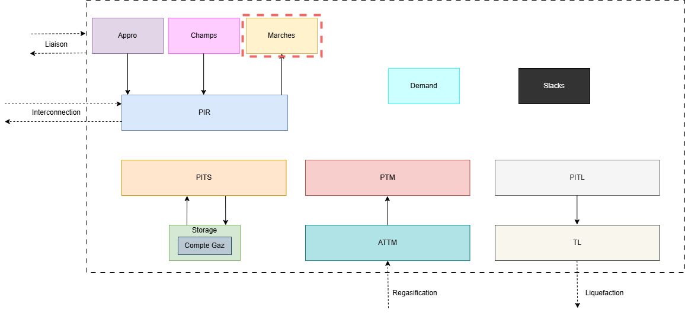

:orphan:  .. NOT DELETE: Avoid warning about document not being included in any toctree

Markets
=======

.. contents::
    :depth: 2
    :local:

General introduction
--------------------

The goal of this module is to introduce a market where the produced gas could be sold or purchased.

In the global picture of the object available in Cactus we'll focus on the following ones:

Technical description and model assumptions
-------------------------------------------

The global modeling of the market lies only on two main equations:

.. math:: \text{MaxSold} \leq \text{Market} \leq \text{MaxBought}

Where, the two parameters MaxSold and MaxBought are defined in the :ref:`Marches<target_marches>` sheet.

The quantity that is bought on a market (aside from the spot one) must be equal on all periods:

.. math:: \text{Market}_{p} = \text{Market}_{p-1}

Then, the markets intervene in two other constraints in the rest of the model:

    - In the `CtrBilanZone`, where the gas bought or sold on the markets is taken into account at the zone level.
    - In the :ref:`Balance of a PIR<target_ctr_bilan_pir_entree>` where the gas bought or sold can also be transferred to the rest of the system.

Finally, the price of the gas is taken into account in the objective function of the model.

.. math:: \text{ObjFunction} += \text{Market} \times \text{Price}

Excel input sheets
------------------

.. _target_marches:
.. admonition:: Marches
    :class: error

    *Sheet Description*: This sheet controls the markets where the gas can be purchased or sold. The markets are defined by their name, delivery zone, maximum daily purchase, maximum daily sale, price and if they are the spot or not. Such modelling in Cactus is kind of dual to the classical way of using this tool. Here the goal is not to meet a demand but to optimize the purchase and sale of gas on the markets.

    .. list-table::
        :widths: 25 25 25 25 25 25
        :header-rows: 1

        * - marche	
          - livraison
          - max achat journalier [MWh/j]
          - max vente journalier [MWh/j]
          - prix [€/MWh]
          - spot {0,1}
        * - Market (ex: Market_FR)
          - Delivery zone (ex: FR)
          - Max daily purchase [MWh/d] (ex: Max_Buy_FR)
          - Max daily sale [MWh/d] (ex: 500)
          - Price [€/MWh] (ex: Prix_Market_FR)
          - Spot {0,1} (ex: 1)

    ⚙️ marche
        * *Description:* Unique name of the market.
        * *Unit:* *None*
        * *Validity:* String

    ⚙️ livraison
        * *Description:* Delivery zone.
        * *Unit:* *None*
        * *Validity:* String

    ⚙️ max achat journalier [MWh/j]
        * *Description:* Maximum daily purchase.
        * *Unit:* MWh/d
        * *Validity:* Float or String. If String, then it must refer to a value defined in the :ref:`MaxMarches<target_max_marches>` sheet.

    ⚙️ max vente journalier [MWh/j]
        * *Description:* Maximum daily sale.
        * *Unit:* MWh/d
        * *Validity:* Float or String. If String, then it must refer to a value defined in the :ref:`MaxMarches<target_max_marches>` sheet.

    ⚙️ prix [€/MWh] 
        * *Description:* Price for purchasing or selling gas.
        * *Unit:* €/MWh
        * *Validity:* Float or String. If String, then it must refer to a value defined in the :ref:`PrixApproParPdt<target_prix_appro_par_pdt>` sheet.

    ⚙️ spot {0,1}    
        * *Description:* Bollean to flag if the market is the *spot* or not.
        * *Unit:* *None*
        * *Validity:* Boolean

.. _target_max_marches:
.. admonition:: MaxMarches
    :class: error

    *Sheet Description*: This sheet let the user refine the data passed in the :ref:`Marches<target_marches>` sheet. The user can here provide a time series for the maximum daily purchase and sale of gas on the markets.

    .. list-table::
        :widths: 25 25 25
        :header-rows: 1

        * - Periode
          - Value1
          - Value2 
        * - Period (ex: 2020)
          - Value1 (ex: 500)
          - Value2 (ex: 1000)

    ⚙️ Periode
        * *Description:* Unique index for the period.
        * *Unit:* *None*
        * *Validity:* Date. It must refer to a value defined in the :ref:`Horizon<target_horizon>` sheet.