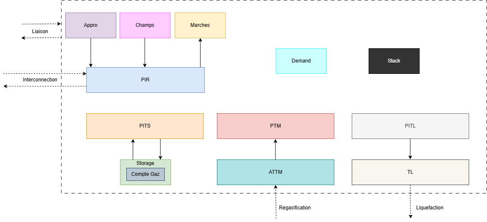

:orphan:  .. NOT DELETE: Avoid warning about document not being included in any toctree

.. _target_model_overview_module:
Model Overview
==============

.. contents::
    :depth: 2
    :local:

General introduction
--------------------

The different parameters that are define here will structure the backbone of the whole simulations. Some are purely technical ones (for instance the ones in the :ref:`Options<target_options>` or in the :ref:`Scalaire<target_scalaire>` sheets) and some are more business oriented (like the ones in the :ref:`Zones<target_zones>` sheet). The user can define the periods of the simulation in the :ref:`Horizon<target_horizon>` sheet.

Hereunder we'll describe:
    - The `Horizon` sheet that defines the periods of the simulation, and how to handle different periods.
    - The `Zones` sheet that defines the topology of the simulation, and the balance equation that involves many objects.

Here is an aggregated summary of what happens in a zone:

Note that there is a zonal equilibrium, which means that within the zone (dotted lines on the picture above) everything that goes in must go out. The balance equation is described hereunder.

Technical description and model assumptions
-------------------------------------------

Zone Balance Equation
^^^^^^^^^^^^^^^^^^^^^

This equation ensures that the total inflow and outflow of resources in a zone are balanced. Here's a breakdown of the main components:

1. **Inflow Components:**
     - **PIR, PITS, PTM, Marche, and Liaison Aval:** These terms represent the quantities entering the zone from various sources like PIR, PITS, PTM, Marche, and Liaison Aval.

.. math:: \text{Inflow} = \sum (\text{PIR}) + \sum (\text{PITS}) + \sum (\text{PTM}) + \sum (\text{Marche}) + \sum (\text{Liaison Aval})

2. **Outflow Components:**
     - **PIR, PITS:** Quantities exiting the zone.
     - **Demand:** The demand in the zone, including technical consumption.
     - **Technical Consumption in Regas Plants (PTM, TM, Liaison):** Adjustments for fuel used in regasification plants.
     - **Demand Inter:** Additional demand in the zone ...
     - **Effacement:** ... That could be shut down partially.
     - **Technical Consumption in Pipes:** Fuel used in pipelines, split between upstream and downstream zones.
     - **PITL:** Quantities used for the liquefaction plants.

.. math:: \text{Outflow} = \sum (\text{PIR}) + \sum (\text{PITS}) + \text{Demand} + \text{Technical Consumption} + \text{Demand Inter} - \text{Effacement} + \sum (\text{Pipes}) + \text{PITL}

3. **Slack:**
     - If the `Ecart` parameter is set to 1 in the Options sheet, two slack variables (up and down) are added to the zone balance equation: `eZonePlus` and `eZoneMoins`. These slacks are penalized in the objective function based on the parameters `Cout Deficit [€/MWh]` and `Cout Excedent [€/MWh]`

.. math:: ObjFunction += \text{CoutExcedent} \times \text{eZonePlus} - \text{CoutDeficit} \times \text{eZoneMoins}

**Overall Balance Equation:**

.. math::
    Inflow = Outflow + eZonePlus - eZoneMoins

Periods
^^^^^^^

In Cactus, the user can define the periods of the simulation in the :ref:`Horizon<target_horizon>` sheet. The granularity can be set up by the user (daily, weekly, monthly, yearly etc.). The periods are defined by their unique index, the start date, and a boolean that states whether the period is a peak period or not. Most of the runs are done considering months and the period will go for 1 to 5 years. Keep in mind that the purpose of the tool is to give market insights and not to do real-time operations.

Note that for many objects we have a behavior that is common for all the periods but we add specific constraints for the begining of the horizon (example, for a storage its stock level will depend on the previous state level, the injections and the extractions, but for the first period it's possible to force the level of it). Note also that we model *peaks* periods (called *pointe* in the input). Such periods are flagged in the input sheet as specific as different equations will be applied. It becomes especially true when the user wants to model contract with specific behavior during peak periods (in winter when the demand is high and the system is constrained).

Finally, it is possible to define also objects in the input and restrict the horizon of the simulation. It allows for instance to have a master file that represents the whole system and to run different scenarios by changing the horizon.

For the sub-period constraints (like the ratcheting ones) define with CATS see the :ref:`CATS<target_cats>` sheet.

Excel input sheets
------------------

.. _target_horizon:

.. admonition:: Horizon
    :class: error

    *Sheet Description*: Definition of the periods of the optimization horizon.

    .. list-table::
        :widths: 25 25 25
        :header-rows: 1

        * - Periode
          - Date debut
          - Pointe (1)
        * - Index1 (ex: 1)
          - Date1 (ex: 01/01/2020)
          - BooleanPeak1 (ex: 0)
        * - Index2 (ex: 2)
          - Date2 (ex: 01/02/2020)
          - BooleanPeak2 (ex: 1)

    *Mandatory sheet*: ✅

    ⚙️ Periode
        * *Description:* Unique index for the period.
        * *Unit:* *None*
        * *Validity:* Integer

    ⚙️ Date debut
        * *Description:* Date of the beginning of the period.
        * *Unit:* *None*
        * *Validity:* At least two periods must be defined. The granularity can be set up by the user (daily, weekly, monthly, yearly etc.).

    ⚙️ Pointe (1)
        * *Description:* Boolean that state whether the period is a peak period or not.
        * *Default value:* 0 (not a peak period)
        * *Unit:* *None*
        * *Validity:* Boolean

.. _target_zones:

.. admonition:: Zones
    :class: error

    *Sheet Description*: Topology of the simulation. The user can define all the zones (country, region or even virtual location) that will be used in the simulation. It is also here that the user defines the slack variables for the deficit and excess production of gas in the given zone.

    .. list-table::
        :widths: 25 25 25
        :header-rows: 1

        * - Zones
          - Cout Deficit [€/MWh]
          - Cout Excedent [€/MWh]
        * - ZoneName1 (ex: FR)
          - DeficitCost1 (ex: 400)
          - ExcessCout1 (ex: 10)
        * - ZoneName2 (ex: FR-B)
          - DeficitCost2 (ex: 400)
          - ExcessCost2 (ex: 10)

    *Mandatory sheet*: ✅

    ⚙️ Zones
        * *Description:* Name of the zone.
        * *Unit:* *None*
        * *Validity:* String

    ⚙️ Cout Deficit [€/MWh]
        * *Description:* Value of the slack variable for the deficit (lost load).
        * *Default value:* *None* - Good practice is to set it up at 400 €/MWh.
        * *Unit:* €/MWh
        * *Validity:* Float

    ⚙️ Cout Excedent [€/MWh]
        * *Description:* Value of the slack variable for the excess (curtailment).
        * *Default value:* *None* - Good practice is to set it up at 10 €/MWh.
        * *Unit:* €/MWh
        * *Validity:* Float

.. _target_options:

.. admonition:: Options
    :class: error

    *Sheet Description*: This sheet contains all the options that the user can set up for the simulation.

    .. list-table::
        :widths: 25 25 25
        :header-rows: 1

        * - Option
          - Parameter
          - Value
        * - Option1 (ex: Ecart)
          - Parameter (ex: Activated)
          - Value (ex: 1)
        * - Option2 (ex: LNG)
          - Parameter (ex: Value)
          - Value (ex: 0)

    *Mandatory sheet*: ✅

    ⚙️ Option
        * *Description:* Name of the options. Note that such options can be skipped if not useful. The list of the options available is the following:
            
            - Ecart: Use this option to activate the slack variables for the deficit and excess production of gas in the given zone. Note that if you don't use it the computational time might increase a lot as the problem becomes more tight.
            - LNG: Use this option to activate the :doc:`LNG Shipping<shipping>` module. Basically it allows to consider duration of LNG trips between LNG Nodes instead of instantaneous transfer between any LNG nodes.
            - Monte-Carlo: Monte-Carlo simulation for the uncertainty of the demand. The number of simulations is controlled by the parameter in the code called `nb_iter`.
            - SDDP: Use this option to activate the Stochastic Dual Dynamic Programming (:doc:`SDDP<sddp>`) algorithm. This option is incompatible with the Monte-Carlo and the LNG one.
        
        * *Unit:* *None*
        * *Validity:* String

    ⚙️ Parameter
        * *Description:* Whether the option is *Activated* or *SDDP* specific ones. If the name of the option is *SDDP*, the user can specify different options in this field. When using SDDP algorithm, the user can select amongst those options:
  
            - Simulation (Boolean): Use this option to leverage on cuts that have already been built in a previous run.
            - Load Previous Cuts (Boolean): Load the cuts from a previous run (warm start). The algorithm will start from those cuts and build new ones on top.
            - Cuts Number (Integer): Number of cuts to build (mandatory option when using SDDP).
            - Max Rolling Cut Nb (Integer > 0): Cap the number of cuts to keep in memory for building the additionnal ones.
            - Workers Number (Integer, >= 2): Number of workers to use for the parallelization of the cuts. Be careful, it's capped by the number of core available on the machine (a typical number value could be 8, so you can go up to 6 workers for instance).
  
        * *Unit:* *None*
        * *Validity:* String

    ⚙️ Value
        * *Description:* Boolean for activation of not of the option. It can also be a integer if SDDP is chosen.
        * *Unit:* *None*
        * *Validity:* Boolean

    Here is the how the option sheet should look like:

    .. list-table::
        :widths: 25 25 25
        :header-rows: 1

        * - Option
          - Parameter
          - Value
        * - Ecart
          - Activated
          - 0/1
        * - LNG
          - Activated
          - 0/1
        * - Monte-Carlo
          - Activated
          - 0/1
        * - SDDP
          - Activated
          - 0/1
        * - SDDP
          - Simulation
          - 0/1
        * - SDDP
          - Load Previous Cuts
          - 0/1
        * - SDDP
          - Cuts Number
          - 0/1 .. /P
        * - SDDP
          - Max Rolling Cut Nb
          - 0/1 .. /Q
        * - SDDP
          - Workers Number
          - 2/3 .. /R

.. _target_scalaire:

.. admonition:: Scalaire
    :class: error

    *Sheet Description*: Scalar parameters usd in the simulation.

    .. list-table::
        :widths: 25 25 25 25 25 25 25
        :header-rows: 1

        * - Discount rate [% pa]
          - Cout Ecart [€/MWh]
          - Vessel Heel
          - BOR Standby Laden Ship [multiplier %]
          - Travel Max BOR [days]
          - Standby Max BOR [days]
          - Fixed Load Unload Time [days]
        * - Discount rate (ex: 0.05)
          - Slack Cost (ex: 10 000)
          - Vessel Heel (ex: 0.02)
          - BOR Stand by Laden Ship (ex: 0.75)
          - Travel Max BOR (ex: 40)
          - Standby Max BOR (ex: 90)
          - Fixed Load Unload Time (ex: 1)

    *Mandatory sheet*: ✅

    ⚙️ Discount rate [% pa]
        * *Description:* Discount rate for the NPV calculation. Financial term that represent the depreciation of money `Discounting - Wikipedia <https://en.wikipedia.org/wiki/Discounting>`_. It means that 1€ in year +1 will be equivalent to 1€/r today.
        * *Unit:* % pa
        * *Validity:* Float

    ⚙️ Cout Ecart [€/MWh]
        * *Description:* Value of the slack variable for the modelling variables (does not have any business meaning).
        * *Default value:* *None* - Good practice is to set it up at 10 000 €/MWh.
        * *Unit:* €/MWh
        * *Validity:* Float

    ⚙️ Vessel Heel 
        * *Description:* Heel LNG is the quantity of LNG retained in the cargo to maintain their cryogenic temperatures. This parameter is used in the :doc:`LNG Shipping<shipping>` module and can be left empty if not used.
        * *Unit:* *None*
        * *Validity:* Float

    ⚙️ BOR Standby Laden Ship [multiplier %]
        * *Description:* Boil-off rate (not due travel fueling), the amount of liquid that is evaporating from a cargo due to heat leakage and expressed in % of total liquid volume per unit time. This parameter is used in the :doc:`LNG Shipping<shipping>` module and can be left empty if not used.
        * *Unit:* *None*
        * *Validity:* Float

    ⚙️ Travel Max BOR [days]
        * *Description:* Maximal number of days during which vessels can travel. This parameter is used in the :doc:`LNG Shipping<shipping>` module and can be left empty if not used.
        * *Unit:* days
        * *Validity:* Integer

    ⚙️ Standby Max BOR [days]
        * *Description:* Maximal number of days during which vessels can be in standby. This parameter is used in the :doc:`LNG Shipping<shipping>` module and can be left empty if not used.
        * *Unit:* days
        * *Validity:* Integer

    ⚙️ Fixed Load Unload Time [days]
        * *Description:* Fixed time for loading and unloading the LNG vessels. This parameter is used in the :doc:`LNG Shipping<shipping>` module and can be left empty if not used.
        * *Unit:* days
        * *Validity:* Integer