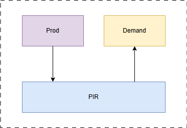
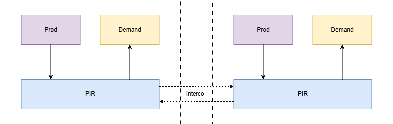
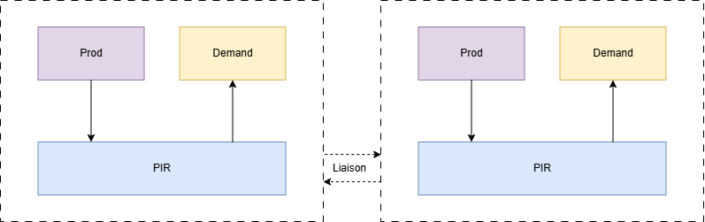
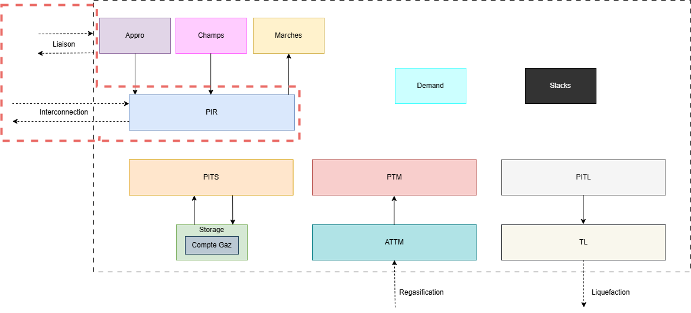

:orphan:  .. NOT DELETE: Avoid warning about document not being included in any toctree

Pipelines
=========

.. contents::
    :depth: 2
    :local:

General introduction
--------------------

This module is used to define the interconnections of the network. It is central one as it's used to model the pipes and the links with the zones. It defines the way the gas flows between regions (aside from the one that is transported by ships).
Once produced, the gas can either be liquefied and then be transported by ships (it will be re-liquefied later on), or directly be injected in the network. Here we'll describe the latter case, for the former one, check the :ref:`LNG<target_lng_module>` module.

Once the flow is produced (see the Production module), it needs to be injected into the system. To do so, the gas is injected through the PIR. Here is a simplistic view of the process:

Everything that is located in the dotted line belongs to a zone. Hence, when there are some exchanges between zones it goes through the following process:

Indeed, the :ref:`Interconnexion<target_interconnexion>` sheet is used to model the pipe that goes from one PIR to another. It is also possible to use the :ref:`Liaison<target_liaison>` sheet to model the link between two zones. The main difference between the two is that the *liaison* has a capacity that is limited, while the *interco* is not (but could be set on the PIR).

In the global picture of the object available in Cactus we'll focus on the following ones:

Technical description and model assumptions
-------------------------------------------

Just as presented above, the transport of gas via the land needs two part to be modelled. The first one being the pipe in itself (it can either be a *liaison* or an *interco*), and the second one being the PIR. The PIR should be seen as a virtual object that allow to link the pipe to the rest of the zone.

As described above, the *interconnection* object is very simple, it's simply a link between two *PIR*. Its contribution in the model only appears in the equation `CtrBilanPIREntree`:

.. _target_ctr_bilan_pir_entree:
.. math:: 
    \begin{align*}
        \text{PIR in} &= \sum \text{Prod (Appro)} \\
                      &+ \sum \text{Prod (Fields)} \\
                      &+ \sum \text{Markets} \\
                      &+ \sum \text{Interco in} \times \text{Efficiency} \\
    \end{align*}

The `CtrBilanPIRSortie` is even simpler:

.. math:: \text{PIR out} = \sum \text{Interco out} \times \text{Efficiency}

The *liaison* object is a bit more complex as it has a capacity that is limited. The model will have to size the *liaison* with an associate cost (so it will impact the Objective Function), and the flow that goes through the *liaison* will be also associate with a fee. Then, it bypass the PIR and is then directly involved in the balance of the zone (`CtrBilanZone`) for both what goes in an out of a zone. Finally, there are two global equations about what goes in and out of this object:

.. math:: \text{Liaison out} = \text{Liaison in} \times \text{Efficiency}

And for the capacity:

.. math:: \text{Liaison out} \leq \text{Capacity}

Now finally, the PIR is a central object, where both what goes in and out of it are involved in the `CtrBilanZone` main equation. on top of that, the capacity of the in and out flows are subject to an optimization (part of it is already available via the *souscrite* capa and part of it can be increased via the *dispo* one). Note also that it is accounted in the Objective Function with the associated cost:

.. math:: 
    \begin{align*}
        ObjFunction +&= \text{Capa PIR in} \times \text{Tarif in} \\
                     &+ \text{Capa PIR out} \times \text{Tarif out} 
                     &+ \text{Qte PIR in} \times \text{Tarif in} \\
                     &+ \text{Qte PIR out} \times \text{Tarif out} \\
                     &+ \text{Capa Liaison in} \times \text{Tarif in} \\
                     &+ \text{Qte Liaison in} \times \text{Tarif in} \\
    \end{align*}

Excel input sheets
------------------

.. _target_pir:
.. admonition:: PIR
    :class: error

    *Sheet Description*: The PIR (Point d'Interconnexion de Réseau) sheet contains the information about the interconnection points of the network. It is an object used to model the link between the pipe and a zone. It's a central object in Cactus as it controls the capacity of the gas coming in or out of a zone.

    .. list-table::
        :widths: 25 25 25 25 25 25 25 25 25 25 25 25 25 25 25 25 25 25 25 25 25 25 25 25 25 25 25 25 25 25 25 25 25 25 25 25 25 25 25 25 25 25 25 25 25 25 25 25 25 25 25 25 25 25 25 25 25 25 25 25 25 25 25 25 25 25 25 25 25 25 25 25 25 25 25 25 25 25 25 25 25 25 25 25 25 25 25 25 25 25 25 25 25
        :header-rows: 1

        * - Nom
          - zone
          - Capacité souscrite en entrée [MWh/j]
          - Capacité dispo en entrée [MWh/j]
          - Capacité souscrite en sortie [MWh/j]
          - Capacité dispo en sortie [MWh/j]
          - Part de la capacité d'entrée à mettre de côté pour le court terme [%]
          - Part de la capacité de sortie à mettre de côté pour le court terme [%]
          - Mois démarrage capas annuelles
          - Début modélisation capas annuelles entrée
          - Début modélisation capas annuelles sortie
          - Début modélisation capas trimestrielles entrée
          - Début modélisation capas trimestrielles sortie
          - Début modélisation capas mensuelles entrée
          - Début modélisation capas mensuelles sortie
          - Début modélisation capas journalières entrée
          - Début modélisation capas journalières sortie
          - Fin modélisation capas annuelles entrée
          - Fin modélisation capas annuelles sortie
          - Fin modélisation capas trimestrielles entrée
          - Fin modélisation capas trimestrielles sortie
          - Fin modélisation capas mensuelles entrée
          - Fin modélisation capas mensuelles sortie
          - Fin modélisation capas journalières entrée
          - Fin modélisation capas journalières sortie
          - Tarif Capacite entree [€/MWh/j]
          - Tarif Capacite sortie [€/MWh/j]
          - Tarif Variable entree [€/MWh]
          - Tarif Variable sortie [€/MWh]
          - Gas-in-kind entrée [%]
          - Gas-in-kind sortie [%]
          - Multiplicateur trimestriel Tarif Capa d'entrée
          - Multiplicateur mensuel Tarif Capa d'entrée
          - Multiplicateur journalier Tarif Capa d'entrée
          - Multiplicateur trimestriel Tarif Capa de sortie
          - Multiplicateur mensuel Tarif Capa de sortie
          - Multiplicateur journalier Tarif Capa de sortie
          - Facteur saisonnier trimestriel entrée Q1
          - Facteur saisonnier trimestriel entrée Q2
          - Facteur saisonnier trimestriel entrée Q3
          - Facteur saisonnier trimestriel entrée Q4
          - Facteur saisonnier trimestriel sortie Q1
          - Facteur saisonnier trimestriel sortie Q2
          - Facteur saisonnier trimestriel sortie Q3
          - Facteur saisonnier trimestriel sortie Q4
          - Facteur saisonnier mensuel entrée Janvier
          - Facteur saisonnier mensuel entrée Février
          - Facteur saisonnier mensuel entrée Mars
          - Facteur saisonnier mensuel entrée Avril
          - Facteur saisonnier mensuel entrée Mai
          - Facteur saisonnier mensuel entrée Juin
          - Facteur saisonnier mensuel entrée Juillet
          - Facteur saisonnier mensuel entrée Août
          - Facteur saisonnier mensuel entrée Septembre
          - Facteur saisonnier mensuel entrée Octobre
          - Facteur saisonnier mensuel entrée Novembre
          - Facteur saisonnier mensuel entrée Décembre
          - Facteur saisonnier mensuel sortie Janvier
          - Facteur saisonnier mensuel sortie Février
          - Facteur saisonnier mensuel sortie Mars
          - Facteur saisonnier mensuel sortie Avril
          - Facteur saisonnier mensuel sortie Mai
          - Facteur saisonnier mensuel sortie Juin
          - Facteur saisonnier mensuel sortie Juillet
          - Facteur saisonnier mensuel sortie Août
          - Facteur saisonnier mensuel sortie Septembre
          - Facteur saisonnier mensuel sortie Octobre
          - Facteur saisonnier mensuel sortie Novembre
          - Facteur saisonnier mensuel sortie Décembre
          - Facteur saisonnier journalier entrée Janvier
          - Facteur saisonnier journalier entrée Février
          - Facteur saisonnier journalier entrée Mars
          - Facteur saisonnier journalier entrée Avril
          - Facteur saisonnier journalier entrée Mai
          - Facteur saisonnier journalier entrée Juin
          - Facteur saisonnier journalier entrée Juillet
          - Facteur saisonnier journalier entrée Août
          - Facteur saisonnier journalier entrée Septembre
          - Facteur saisonnier journalier entrée Octobre
          - Facteur saisonnier journalier entrée Novembre
          - Facteur saisonnier journalier entrée Décembre
          - Facteur saisonnier journalier sortie Janvier
          - Facteur saisonnier journalier sortie Février
          - Facteur saisonnier journalier sortie Mars
          - Facteur saisonnier journalier sortie Avril
          - Facteur saisonnier journalier sortie Mai
          - Facteur saisonnier journalier sortie Juin
          - Facteur saisonnier journalier sortie Juillet
          - Facteur saisonnier journalier sortie Août
          - Facteur saisonnier journalier sortie Septembre
          - Facteur saisonnier journalier sortie Octobre
          - Facteur saisonnier journalier sortie Novembre
          - Facteur saisonnier journalier sortie Décembre
        * - Name (ex: Amber Grid | LT | Kiemenai)
          - Zone (ex: LT)
          - Subscribed capacity in input [MWh/d] (ex: Entree_Amber Grid | LT | Kiemenai)
          - Capacity available in input [MWh/d] (ex: AddEntree_Amber Grid | LT | Kiemenai)
          - Subscribed capacity in output [MWh/d] (ex: Sortie_Amber Grid | LT | Kiemenai)
          - Capacity available in output [MWh/d] (ex: AddSortie_Amber Grid | LT | Kiemenai)
          - Percentage of input capacity reserved for short term [%] (ex: 10%)
          - Percentage of output capacity reserved for short term [%] (ex: 10%)
          - Start month for annual capacities (ex: 10)
          - Start of annual input capacity modeling (ex: 1/1/2020)
          - Start of annual output capacity modeling (ex: 1/1/2020)
          - Start of quarterly input capacity modeling (ex: 1/1/2020)
          - Start of quarterly output capacity modeling (ex: 1/1/2020)
          - Start of monthly input capacity modeling (ex: 1/1/2020)
          - Start of monthly output capacity modeling (ex: 1/1/2020)
          - Start of daily input capacity modeling (ex: 1/1/2020)
          - Start of daily output capacity modeling (ex: 1/1/2020)
          - End of annual input capacity modeling (ex: 1/1/2100)
          - End of annual output capacity modeling (ex: 1/1/2100)
          - End of quarterly input capacity modeling (ex: 1/1/2100)
          - End of quarterly output capacity modeling (ex: 1/1/2100)
          - End of monthly input capacity modeling (ex: 1/1/2100)
          - End of monthly output capacity modeling (ex: 1/1/2100)
          - End of daily input capacity modeling (ex: 1/1/2100)
          - End of daily output capacity modeling (ex: 1/1/2100)
          - Input capacity tariff [€/MWh/d] (ex: 0.119166667)
          - Output capacity tariff [€/MWh/d] (ex: 0.419166667)
          - Variable input tariff [€/MWh] (ex: 0)
          - Variable output tariff [€/MWh] (ex: 0)
          - Gas-in-kind input [%] (ex: 0)
          - Gas-in-kind output [%] (ex: 0)
          - Quarterly input capacity tariff multiplier (ex: 1.25)
          - Monthly input capacity tariff multiplier (ex: 1.5)
          - Daily input capacity tariff multiplier (ex: 2.25)
          - Quarterly output capacity tariff multiplier (ex: 1.25)
          - Monthly output capacity tariff multiplier (ex: 1.4)
          - Daily output capacity tariff multiplier (ex: 1.5)
          - Quarterly seasonal factor input Q1 (ex: 1)
          - Quarterly seasonal factor input Q2 (ex: 1)
          - Quarterly seasonal factor input Q3 (ex: 1)
          - Quarterly seasonal factor input Q4 (ex: 1)
          - Quarterly seasonal factor output Q1 (ex: 1)
          - Quarterly seasonal factor output Q2 (ex: 1)
          - Quarterly seasonal factor output Q3 (ex: 1)
          - Quarterly seasonal factor output Q4 (ex: 1)
          - Monthly seasonal factor input January (ex: 1)
          - Monthly seasonal factor input February (ex: 1)
          - Monthly seasonal factor input March (ex: 1)
          - Monthly seasonal factor input April (ex: 1)
          - Monthly seasonal factor input May (ex: 1)
          - Monthly seasonal factor input June (ex: 1)
          - Monthly seasonal factor input July (ex: 1)
          - Monthly seasonal factor input August (ex: 1)
          - Monthly seasonal factor input September (ex: 1)
          - Monthly seasonal factor input October (ex: 1)
          - Monthly seasonal factor input November (ex: 1)
          - Monthly seasonal factor input December (ex: 1)
          - Monthly seasonal factor output January (ex: 1)
          - Monthly seasonal factor output February (ex: 1)
          - Monthly seasonal factor output March (ex: 1)
          - Monthly seasonal factor output April (ex: 1)
          - Monthly seasonal factor output May (ex: 1)
          - Monthly seasonal factor output June (ex: 1)
          - Monthly seasonal factor output July (ex: 1)
          - Monthly seasonal factor output August (ex: 1)
          - Monthly seasonal factor output September (ex: 1)
          - Monthly seasonal factor output October (ex: 1)
          - Monthly seasonal factor output November (ex: 1)
          - Monthly seasonal factor output December (ex: 1)
          - Daily seasonal factor input January (ex: 1)
          - Daily seasonal factor input February (ex: 1)
          - Daily seasonal factor input March (ex: 1)
          - Daily seasonal factor input April (ex: 1)
          - Daily seasonal factor input May (ex: 1)
          - Daily seasonal factor input June (ex: 1)
          - Daily seasonal factor input July (ex: 1)
          - Daily seasonal factor input August (ex: 1)
          - Daily seasonal factor input September (ex: 1)
          - Daily seasonal factor input October (ex: 1)
          - Daily seasonal factor input November (ex: 1)
          - Daily seasonal factor input December (ex: 1)
          - Daily seasonal factor output January (ex: 1)
          - Daily seasonal factor output February (ex: 1)
          - Daily seasonal factor output March (ex: 1)
          - Daily seasonal factor output April (ex: 1)
          - Daily seasonal factor output May (ex: 1)
          - Daily seasonal factor output June (ex: 1)
          - Daily seasonal factor output July (ex: 1)
          - Daily seasonal factor output August (ex: 1)
          - Daily seasonal factor output September (ex: 1)
          - Daily seasonal factor output October (ex: 1)
          - Daily seasonal factor output November (ex: 1)
          - Daily seasonal factor output December (ex: 1)

    ⚙️ Nom
        * *Description:* Unique name of the PIR.
        * *Unit:* *None*
        * *Validity:* String

    ⚙️ Zone
        * *Description:* Name of a zone.
        * *Unit:* *None*
        * *Validity:* String. Must be part of the zones defined in the :ref:`Zones<target_zones>` sheet.

    ⚙️ Capacité souscrite en entrée [MWh/j]
        * *Description:* Subscribed capacity in input.
        * *Unit:* MWh/d
        * *Validity:* Float or String. If String, then it must refer to a value defined in the :ref:`CapaParPdt<target_capa_par_pdt>` sheet.

    ⚙️ Capacité dispo en entrée [MWh/j]
        * *Description:* Capacity available in input.
        * *Unit:* MWh/d
        * *Validity:* Float or String. If String, then it must refer to a value defined in the :ref:`CapaParPdt<target_capa_par_pdt>` sheet.

    ⚙️ Capacité souscrite en sortie [MWh/j]
        * *Description:* Subscribed capacity in output.
        * *Unit:* MWh/d
        * *Validity:* Float or String. If String, then it must refer to a value defined in the :ref:`CapaParPdt<target_capa_par_pdt>` sheet.

    ⚙️ Capacité dispo en sortie [MWh/j]
        * *Description:* Capacity available in output.
        * *Unit:* MWh/d
        * *Validity:* Float or String. If String, then it must refer to a value defined in the :ref:`CapaParPdt<target_capa_par_pdt>` sheet.

    ⚙️ Part de la capacité d'entrée à mettre de côté pour le court terme [%]
        * *Description:* Percentage of input capacity reserved for short term.
        * *Unit:* %
        * *Validity:* Float

    ⚙️ Part de la capacité de sortie à mettre de côté pour le court terme [%]
        * *Description:* Percentage of output capacity reserved for short term.
        * *Unit:* %
        * *Validity:* Float

    ⚙️ Mois démarrage capas annuelles
        * *Description:* Start month for annual capacities.
        * *Unit:* Month
        * *Validity:* Integer

    ⚙️ Début modélisation capas annuelles entrée
        * *Description:* Start of annual input capacity modeling.
        * *Unit:* Date
        * *Validity:* Date

    ⚙️ Début modélisation capas annuelles sortie
        * *Description:* Start of annual output capacity modeling.
        * *Unit:* Date
        * *Validity:* Date

    ⚙️ Début modélisation capas trimestrielles entrée
        * *Description:* Start of quarterly input capacity modeling.
        * *Unit:* Date
        * *Validity:* Date

    ⚙️ Début modélisation capas trimestrielles sortie
        * *Description:* Start of quarterly output capacity modeling.
        * *Unit:* Date
        * *Validity:* Date

    ⚙️ Début modélisation capas mensuelles entrée
        * *Description:* Start of monthly input capacity modeling.
        * *Unit:* Date
        * *Validity:* Date

    ⚙️ Début modélisation capas mensuelles sortie
        * *Description:* Start of monthly output capacity modeling.
        * *Unit:* Date
        * *Validity:* Date

    ⚙️ Début modélisation capas journalières entrée
        * *Description:* Start of daily input capacity modeling.
        * *Unit:* Date
        * *Validity:* Date

    ⚙️ Début modélisation capas journalières sortie
        * *Description:* Start of daily output capacity modeling.
        * *Unit:* Date
        * *Validity:* Date

    ⚙️ Fin modélisation capas annuelles entrée
        * *Description:* End of annual input capacity modeling.
        * *Validity:* Date

    ⚙️ Fin modélisation capas annuelles sortie
        * *Description:* End of annual output capacity modeling.
        * *Unit:* Date

    ⚙️ Fin modélisation capas trimestrielles entrée
        * *Description:* End of quarterly input capacity modeling.
        * *Unit:* Date
        * *Validity:* Date

    ⚙️ Fin modélisation capas trimestrielles sortie
        * *Description:* End of quarterly output capacity modeling.
        * *Unit:* Date
        * *Validity:* Date

    ⚙️ Fin modélisation capas mensuelles entrée
        * *Description:* End of monthly input capacity modeling.
        * *Unit:* Date
        * *Validity:* Date

    ⚙️ Fin modélisation capas mensuelles sortie
        * *Description:* End of monthly output capacity modeling.
        * *Unit:* Date
        * *Validity:* Date

    ⚙️ Fin modélisation capas journalières entrée
        * *Description:* End of daily input capacity modeling.
        * *Unit:* Date
        * *Validity:* Date

    ⚙️ Fin modélisation capas journalières sortie
        * *Description:* End of daily output capacity modeling.
        * *Validity:* Date

    ⚙️ Tarif Capacite entree [€/MWh/j]
        * *Description:* Input capacity tariff.
        * *Unit:* €/MWh/d

    ⚙️ Tarif Capacite sortie [€/MWh/j]
        * *Description:* Output capacity tariff.
        * *Unit:* €/MWh/d
        * *Validity:* Float or String. If String, then it must refer to a value defined in the :ref:`TarifParDate<target_tarif_par_date>` sheet.

    ⚙️ Tarif Variable entree [€/MWh]
        * *Description:* Variable input tariff.
        * *Unit:* €/MWh
        * *Validity:* Float or String. If String, then it must refer to a value defined in the :ref:`TarifParDate<target_tarif_par_date>` sheet.

    ⚙️ Tarif Variable sortie [€/MWh]
        * *Description:* Variable output tariff.
        * *Unit:* €/MWh
        * *Validity:* Float or String. If String, then it must refer to a value defined in the :ref:`TarifParDate<target_tarif_par_date>` sheet.

    ⚙️ Gas-in-kind entrée [%]
        * *Description:* Gas-in-kind input.
        * *Unit:* %
        * *Validity:* Float

    ⚙️ Gas-in-kind sortie [%]
        * *Description:* Gas-in-kind output.
        * *Unit:* %
        * *Validity:* Float

    ⚙️ Multiplicateur trimestriel Tarif Capa d'entrée
        * *Description:* Quarterly input capacity tariff multiplier.
        * *Unit:* *None*
        * *Validity:* Float

    ⚙️ Multiplicateur mensuel Tarif Capa d'entrée
        * *Description:* Monthly input capacity tariff multiplier.
        * *Unit:* *None*
        * *Validity:* Float

    ⚙️ Multiplicateur journalier Tarif Capa d'entrée
        * *Description:* Daily input capacity tariff multiplier.
        * *Unit:* *None*
        * *Validity:* Float

    ⚙️ Multiplicateur trimestriel Tarif Capa de sortie
        * *Description:* Quarterly output capacity tariff multiplier.
        * *Unit:* *None*
        * *Validity:* Float

    ⚙️ Multiplicateur mensuel Tarif Capa de sortie
        * *Description:* Monthly output capacity tariff multiplier.
        * *Validity:* Float

    ⚙️ Multiplicateur journalier Tarif Capa de sortie
        * *Description:* Daily output capacity tariff multiplier.
        * *Validity:* Float

    ⚙️ Facteur saisonnier trimestriel entrée Q1
        * *Description:* Quarterly seasonal factor input Q1.
        * *Unit:* *None*
        * *Validity:* Float

    ⚙️ Facteur saisonnier trimestriel entrée Q2
        * *Description:* Quarterly seasonal factor input Q2.
        * *Unit:* *None*
        * *Validity:* Float

    ⚙️ Facteur saisonnier trimestriel entrée Q3
        * *Description:* Quarterly seasonal factor input Q3.
        * *Unit:* *None*
        * *Validity:* Float

    ⚙️ Facteur saisonnier trimestriel entrée Q4
        * *Description:* Quarterly seasonal factor input Q4.
        * *Unit:* *None*
        * *Validity:* Float

    ⚙️ Facteur saisonnier trimestriel sortie Q1
        * *Description:* Quarterly seasonal factor output Q1.
        * *Validity:* Float

    ⚙️ Facteur saisonnier trimestriel sortie Q2
        * *Description:* Quarterly seasonal factor output Q2.
        * *Unit:* *None*

    ⚙️ Facteur saisonnier trimestriel sortie Q3
        * *Description:* Quarterly seasonal factor output Q3.
        * *Unit:* *None*
        * *Validity:* Float
    ⚙️ Facteur saisonnier trimestriel sortie Q4
        * *Description:* Quarterly seasonal factor output Q4.
        * *Unit:* *None*
        * *Validity:* Float

        * *Description:* Monthly seasonal factor input January.
        * *Validity:* Float

    ⚙️ Facteur saisonnier mensuel entrée Février
        * *Unit:* *None*
        * *Validity:* Float

    ⚙️ Facteur saisonnier mensuel entrée Mars
        * *Description:* Monthly seasonal factor input March.
        * *Validity:* Float

    ⚙️ Facteur saisonnier mensuel entrée Avril
        * *Description:* Monthly seasonal factor input April.
        * *Unit:* *None*
    ⚙️ Facteur saisonnier mensuel entrée Mai
        * *Description:* Monthly seasonal factor input May.
        * *Unit:* *None*
        * *Validity:* Float

        * *Description:* Monthly seasonal factor input June.
        * *Unit:* *None*
        * *Validity:* Float

    ⚙️ Facteur saisonnier mensuel entrée Juillet
       * *Unit:* *None*
       * *Validity:* Float

    ⚙️ Facteur saisonnier mensuel entrée Août
       * *Description:* Monthly seasonal factor input August.
       * *Unit:* *None*
       * *Validity:* Float

    ⚙️ Facteur saisonnier mensuel entrée Septembre
       * *Description:* Monthly seasonal factor input September.
       * *Unit:* *None*
       * *Validity:* Float

    ⚙️ Facteur saisonnier mensuel entrée Octobre
       * *Description:* Monthly seasonal factor input October.
       * *Unit:* *None*
       * *Validity:* Float

    ⚙️ Facteur saisonnier mensuel entrée Novembre
       * *Description:* Monthly seasonal factor input November.
       * *Unit:* *None*
       * *Validity:* Float

    ⚙️ Facteur saisonnier mensuel entrée Décembre
       * *Description:* Monthly seasonal factor input December.
       * *Unit:* *None*
       * *Validity:* Float

    ⚙️ Facteur saisonnier mensuel sortie Janvier
       * *Description:* Monthly seasonal factor output January.
       * *Unit:* *None*
       * *Validity:* Float

    ⚙️ Facteur saisonnier mensuel sortie Février
       * *Description:* Monthly seasonal factor output February.
       * *Unit:* *None*
       * *Validity:* Float

    ⚙️ Facteur saisonnier mensuel sortie Mars
       * *Description:* Monthly seasonal factor output March.
       * *Unit:* *None*
       * *Validity:* Float

    ⚙️ Facteur saisonnier mensuel sortie Avril
       * *Description:* Monthly seasonal factor output April.
       * *Unit:* *None*
       * *Validity:* Float

    ⚙️ Facteur saisonnier mensuel sortie Mai
       * *Description:* Monthly seasonal factor output May.
       * *Unit:* *None*
       * *Validity:* Float

    ⚙️ Facteur saisonnier mensuel sortie Juin
       * *Description:* Monthly seasonal factor output June.
       * *Unit:* *None*
       * *Validity:* Float

    ⚙️ Facteur saisonnier mensuel sortie Juillet
       * *Description:* Monthly seasonal factor output July.
       * *Unit:* *None*
       * *Validity:* Float

    ⚙️ Facteur saisonnier mensuel sortie Août
       * *Description:* Monthly seasonal factor output August.
       * *Unit:* *None*
       * *Validity:* Float

    ⚙️ Facteur saisonnier mensuel sortie Septembre
       * *Description:* Monthly seasonal factor output September.
       * *Unit:* *None*
       * *Validity:* Float

    ⚙️ Facteur saisonnier mensuel sortie Octobre
       * *Description:* Monthly seasonal factor output October.
       * *Unit:* *None*
       * *Validity:* Float

    ⚙️ Facteur saisonnier mensuel sortie Novembre
       * *Description:* Monthly seasonal factor output November.
       * *Unit:* *None*
       * *Validity:* Float

    ⚙️ Facteur saisonnier mensuel sortie Décembre
       * *Description:* Monthly seasonal factor output December.
       * *Unit:* *None*
       * *Validity:* Float

    ⚙️ Facteur saisonnier journalier entrée Janvier
       * *Description:* Daily seasonal factor input January.
       * *Unit:* *None*
       * *Validity:* Float

    ⚙️ Facteur saisonnier journalier entrée Février
       * *Description:* Daily seasonal factor input February.
       * *Unit:* *None*
       * *Validity:* Float

    ⚙️ Facteur saisonnier journalier entrée Mars
       * *Description:* Daily seasonal factor input March.
       * *Unit:* *None*
       * *Validity:* Float

    ⚙️ Facteur saisonnier journalier entrée Avril
       * *Description:* Daily seasonal factor input April.
       * *Unit:* *None*
       * *Validity:* Float

    ⚙️ Facteur saisonnier journalier entrée Mai
       * *Description:* Daily seasonal factor input May.
       * *Unit:* *None*
       * *Validity:* Float

    ⚙️ Facteur saisonnier journalier entrée Juin
       * *Description:* Daily seasonal factor input June.
       * *Unit:* *None*
       * *Validity:* Float

    ⚙️ Facteur saisonnier journalier entrée Juillet
       * *Description:* Daily seasonal factor input July.
       * *Unit:* *None*
       * *Validity:* Float

    ⚙️ Facteur saisonnier journalier entrée Août
       * *Description:* Daily seasonal factor input August.
       * *Unit:* *None*
       * *Validity:* Float

    ⚙️ Facteur saisonnier journalier entrée Septembre
       * *Description:* Daily seasonal factor input September.
       * *Unit:* *None*
       * *Validity:* Float

    ⚙️ Facteur saisonnier journalier entrée Octobre
       * *Description:* Daily seasonal factor input October.
       * *Unit:* *None*
       * *Validity:* Float

    ⚙️ Facteur saisonnier journalier entrée Novembre
       * *Description:* Daily seasonal factor input November.
       * *Unit:* *None*
       * *Validity:* Float

    ⚙️ Facteur saisonnier journalier entrée Décembre
       * *Description:* Daily seasonal factor input December.
       * *Unit:* *None*
       * *Validity:* Float

    ⚙️ Facteur saisonnier journalier sortie Janvier
       * *Description:* Daily seasonal factor output January.
       * *Unit:* *None*
       * *Validity:* Float

    ⚙️ Facteur saisonnier journalier sortie Février
       * *Description:* Daily seasonal factor output February.
       * *Unit:* *None*
       * *Validity:* Float

    ⚙️ Facteur saisonnier journalier sortie Mars
       * *Description:* Daily seasonal factor output March.
       * *Unit:* *None*
       * *Validity:* Float

    ⚙️ Facteur saisonnier journalier sortie Avril
       * *Description:* Daily seasonal factor output April.
       * *Unit:* *None*
       * *Validity:* Float

    ⚙️ Facteur saisonnier journalier sortie Mai
       * *Description:* Daily seasonal factor output May.
       * *Unit:* *None*
       * *Validity:* Float

    ⚙️ Facteur saisonnier journalier sortie Juin
       * *Description:* Daily seasonal factor output June.
       * *Unit:* *None*
       * *Validity:* Float

    ⚙️ Facteur saisonnier journalier sortie Juillet
       * *Description:* Daily seasonal factor output July.
       * *Unit:* *None*
       * *Validity:* Float

    ⚙️ Facteur saisonnier journalier sortie Août
       * *Description:* Daily seasonal factor output August.
       * *Unit:* *None*
       * *Validity:* Float

    ⚙️ Facteur saisonnier journalier sortie Septembre
       * *Description:* Daily seasonal factor output September.
       * *Unit:* *None*
       * *Validity:* Float

    ⚙️ Facteur saisonnier journalier sortie Octobre
       * *Description:* Daily seasonal factor output October.
       * *Unit:* *None*
       * *Validity:* Float

    ⚙️ Facteur saisonnier journalier sortie Novembre
       * *Description:* Daily seasonal factor output November.
       * *Unit:* *None*
       * *Validity:* Float

    ⚙️ Facteur saisonnier journalier sortie Décembre
       * *Description:* Daily seasonal factor output December.
       * *Unit:* *None*
       * *Validity:* Float

.. _target_liaison:
.. admonition:: Liaison
    :class: error

    *Sheet Description*: The link between two zones allows the transport of gas from one zone to another (it mimics a physical pipe).

    .. list-table::
        :widths: 25 25 25 25 25 25 25
        :header-rows: 1
        
        * - Liaison	
          - zone debut	
          - zone fin	
          - Capacite [MWh/j]	
          - Tarif en volume [€/MWh]	
          - Tarif Capacite [€/MWh/j]	
          - % Gaz carburant [0;100]
        * - Link (eg: Tansmed)
          - Start zone (eg: DZ)
          - End zone (eg: TN)
          - Capacity [MWh/d] (eg: 1,091,945)
          - Volume tariff [€/MWh] (eg: 0.01)
          - Capacity tariff [€/MWh/d] (eg: 0.1)
          - % Fuel gas [0;100] (eg: 1.8) 

    ⚙️ Liaison
        * *Description:* Unique name of the link.
        * *Unit:* *None*
        * *Validity:* String

    ⚙️ zone debut
        * *Description:* Start zone.
        * *Unit:* *None*
        * *Validity:* String. Must be part of the zones defined in the :ref:`Zones<target_zones>` sheet.

    ⚙️ zone fin
        * *Description:* End zone.
        * *Validity:* String. Must be part of the zones defined in the :ref:`Zones<target_zones>` sheet.

    ⚙️ Capacite [MWh/j]
        * *Description:* Capacity.
        * *Unit:* MWh/d

    ⚙️ Tarif en volume [€/MWh]
        * *Description:* Volume tariff.
        * *Unit:* €/MWh
        * *Validity:* Float or String. If String, then it must refer to a value defined in the :ref:`TarifParDate<target_tarif_par_date>` sheet.
    ⚙️ Tarif Capacite [€/MWh/j]
        * *Description:* Capacity tariff.
        * *Unit:* €/MWh/d
        * *Validity:* Float or String. If String, then it must refer to a value defined in the :ref:`TarifParDate<target_tarif_par_date>` sheet.

        * *Description:* % Fuel gas.
        * *Unit:* %
        * *Validity:* Float

.. _target_interconnexion:
.. admonition:: Interconnexion
    :class: error

    *Sheet Description*: The interconnection is very similar to the *Liaison*, but it is used to model the transport of gas from one PIR to another. Note that it's not possible to restrict the flow of gas between two PIRs, but one can play on the capacity of the entry or exit PIR.

    .. list-table::
        :widths: 25 25 25 

        * - Nom	
          - PIR debut	
          - PIR fin
        * - Name (eg: Cactus-09 LBTG > GASCADE)
          - Start PIR (eg: LBTG | OPAL | Exit to Gaspool)
          - End PIR (eg: GASCADE | DE-GPL | Entry from OPAL)

    ⚙️ Nom
        * *Description:* Unique name of the interconnection.
        * *Unit:* *None*
        * *Validity:* String

    ⚙️ PIR debut
        * *Description:* Start PIR.
        * *Unit:* *None*
        * *Validity:* String. Must be part of the PIRs defined in the :ref:`PIR<target_pir>` sheet.

    ⚙️ PIR fin
        * *Description:* End PIR.
        * *Unit:* *None*
        * *Validity:* String. Must be part of the PIRs defined in the :ref:`PIR<target_pir>` sheet.

.. _target_maintenance_transport:
.. admonition:: Maintenance Transport
    :class: error

    *Sheet Description*:

    .. list-table::
        :widths: 25 25 25 25 25
        :header-rows: 1

        * - Nom	
          - Direction
          - Debut
          - Fin
          - Capa restante [MWh/j]
        * - Name (eg: GASCADE | DE-GPL | GREIFSWALD)
          - Direction (eg: Entry)
          - Start (eg: 16/07/2019)
          - End (eg: 29/07/2019)
          - Remaining capacity [MWh/d] (eg: 0) 

    ⚙️ Nom
        * *Description:* Unique name of the maintenance transport.
        * *Unit:* *None*
        * *Validity:* String. Must be part of the PIRs defined in the :ref:`PIR<target_pir>` sheet, a PTM defined in the :ref:`PTM<target_ptm>` sheet or a PITS defined in the :ref:`PITS<target_pits>` sheet.

    ⚙️ Direction
        * *Description:* Direction.
        * *Unit:* *None*
        * *Validity:* String. Must be either *Entry* or *Exit*.

    ⚙️ Debut
        * *Description:* Start.
        * *Unit:* *None*
        * *Validity:* Date

    ⚙️ Fin
        * *Description:* End.
        * *Unit:* *None*
        * *Validity:* Date

    ⚙️ Capa restante [MWh/j]
        * *Description:* Remaining capacity.
        * *Unit:* MWh/d
        * *Validity:* Float
