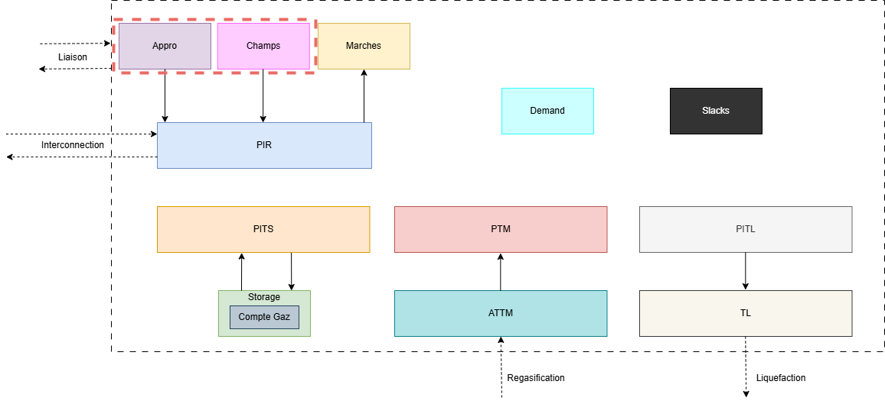

:orphan:  .. NOT DELETE: Avoid warning about document not being included in any toctree

Production
==========

.. contents::
    :depth: 2
    :local:

General introduction
--------------------

The production module is responsible for modeling the gas supply. It can be done in two ways: through gas fields or gas contracts. The gas fields represent the physical gas plant with some real components such the cost for operating them, the overall availability etc., while the gas contracts represent the fixed agreement between two parts with potential adjustment in the annual or periodic offtake. The appros are linked to either a PIR, a TM or a PTM, whereas a field is always linked to a given PIR. 

In the global picture of the object available in Cactus we'll focus on the following ones:

Technical description and model assumptions
-------------------------------------------

Gas supply
^^^^^^^^^^

The supply are contract that are defined by two main elements: the price and the volumes (periodic and annual). The price is rather simple as it's simply a figure (that could be serialized). The volume one is slightly more complex as part of it could be subject to optimization. To reflect this, multiple modes exist:

    * The model chooses both the annual and daily contracted volumes. The size of the strip around the daily volume is proportional to the annual volume contracted.
    * Fix the annual volume (by the user), and the model can choose the daily contracted volume but can't choose the size of the strip around this daily volume (which depends on annual one).
    * The model can't choose neither the daily volume nor the size of the strip around it (and thus of course, nor the annual one).

Thus, the *appros* intervene in the model at different places:

    * In the :ref:`PIR main balance equation <target_ctr_bilan_pir_entree>`
    * In the :ref:`PTM main balance equation <target_ctr_bilan_ptm>`
    * In the :ref:`TM main balance equation <target_ctr_bilan_tm>`

Obviously this is accounted in the objective function as well:

.. math:: ObjFunction += \text{Appro} \times \text{Appro Price}

The three different modes for the flexibility are represented as follow in the model. Of course, on all modes, the main variable remains the Appro.

For the mode 0, the one where the model is the more free, it can both chose the DCQ (periodic delivery of gas) and the size of the strip around the contractual delivery (Appro). The values min and max DCQ are provided by the user.

.. math:: \text{Max DCQ} \times \text{DCQ} \geq \text{Appro} \geq \text{Min DCQ} \times \text{DCQ}

Where the variables are the Appro and the DCQ.

For the mode 1, the model can chose the DCQ but can't chose the strip around the actual Appro (fixed by the user and is proportional to the Volume and the difference between the min and max DCQ).

.. math:: (\text{DCQ Max} - 1) \times \text{Volume} - \text{DCQ} \geq \text{Appro} \geq (\text{DCQ Min} - 1) \times \text{Volume} - \text{DCQ} 

For those two modes, we have also the following constraints (min and max ACQ are provided by the user):

.. math:: \text{Max ACQ} / 365 \geq \text{DCQ} \geq \text{Min ACQ} / 365

For the mode 2, it's the easiest as the model can't chose neither the DCQ nor the strip around the Appro.

.. math:: \text{Max DCQ} \times \text{Volume} / 365 \geq \text{Appro} \geq \text{Min ACQ} \times \text{Volume} / 365

Gas fields
^^^^^^^^^^

The production model includes several key equations that govern the capacity and reserve constraints, as well as the production profiles. Below is a summary of these equations:

1. **Capacity Development**:
    - **Capacity**: Constructs the contracted capacity over the years.

      .. math:: \text{Capacity}_{\text{year}} = \text{Capacity}_{\text{year-1}} + \text{CapacityIncrease}

    - **Max Capacity**: Constraints the maximum contracted capacity of the field.

      .. math:: \text{Capacity}_{\text{year}} \leq \text{MaxCapacity}

2. **Net Capacity Development**:
    - **Net Capacity at Start**: Constructs the developed net capacity at the start of the year.

      .. math:: \text{NetCapacity}_{\text{start, year}} = \text{NetCapacity}_{\text{end, year-1}} + \text{CapacityIncrease}

    - **Net Capacity at End**: Constructs the developed net capacity at the end of the year.
    
      .. math:: \text{NetCapacity}_{\text{end, year}} = \text{NetCapacity}_{\text{start, year}} - \text{CapacityReduction}

3. **Reserve Development**:
    - **Reserve at Start**: Constructs the reserve at the start of the year.
    
      .. math:: \text{Reserve}_{\text{start, year}} = \text{Reserve}_{\text{end, year-1}} + \text{CapacityIncrease}

    - **Max Reserve at Start**: Imposes constraints on the maximum reserve at the start of the year.
    
      .. math:: \text{Reserve}_{\text{start, year}} \leq \text{NetCapacity}_{\text{start, year}}

    - **Reserve at End Before Decommissioning**: Constructs the reserve at the end of the year before decommissioning.
    
      .. math:: \text{Reserve}_{\text{end, year}} = \text{Reserve}_{\text{start, year}} - \text{AnnualProduction}

    - **Max Reserve at End After Decommissioning**: Imposes constraints on the maximum reserve at the end of the year after decommissioning.
    
      .. math:: \text{Reserve}_{\text{end, year}} \leq \text{NetCapacity}_{\text{end, year}}

4. **Production Profiles**:
    - **Annual Production Profile**: Imposes constraints on the annual production profile.
    
      .. math:: \text{AnnualProduction} \leq \text{ProfileSlope} \times \text{NetCapacity}_{\text{start, year}} + \text{ProfileIntercept} \times \text{Reserve}_{\text{start, year}}

    - **Average Daily Production**: Constructs the average daily production for the year.
    
      .. math:: \text{AnnualProduction} = \text{DaysInYear} \times \text{DailyProduction}

5. **Daily Contract Quantity (DCQ) Constraints**:
    - **DCQ by Period**: Imposes DCQ constraints on production by period.
    
      .. math:: \text{PeriodLength} \times \text{MaxDCQ} \times \text{DailyProduction} \geq \text{PeriodProduction} \geq \text{PeriodLength} \times \text{MinDCQ} \times \text{DailyProduction}

6. **Take or Pay Constraints**:
    - **Take or Pay**: Imposes take or pay constraints on a production perimeter.
    
      .. math:: \sum(\text{AnnualProduction}) \geq \text{TakeOrPay}

These equations ensure that the production model adheres to the specified capacity and reserve constraints, while also maintaining the required production profiles and DCQ constraints. The model also includes take or pay constraints to ensure compliance with contractual obligations.

Of course, the production model is also accounted in the objective function as well:

.. math::
    \begin{align*}
        ObjFunction +&= \sum \text{CapacityIncrease} \times \text{CAPEX Capacity} \\
                    &+ \sum \text{CapacityReduction} \times \text{CAPEX Decommissioning} \\
                    &+ \sum \text{PeriodProduction} \times \text{Variable OPEX} \\
                    &+ \sum \text{NetCapacity}_{\text{start, year}} \times \text{Fixed OPEX} \\
                    &+ \sum \text{NetCapacity}_{\text{end, year}} \times \text{Actualized Costs} \\
                    &+ \sum \text{Reserve}_{\text{end, year}} \times \text{VAN} \\
    \end{align*}

Excel input sheets
------------------

Gas supply
^^^^^^^^^^

.. _target_appros:
.. admonition:: Appros
    :class: error

    *Sheet Description*: This sheet controls the gas contracts. Each contract is defined by its name, the minimum and maximum annual contracted volume, the gas price, the minimum and maximum daily contracted volume, the flexibility mode and the yearly volume contracted. With such object the user can define gas supply in the model.

    .. list-table::
        :widths: 25 25 25 25 25 25 25 25
        :header-rows: 1

        * - contrat
          - ACQ Min [%]
          - ACQ Max [%]
          - prix volume [€/MWh]
          - DCQ Min [%]
          - DCQ Max [%]
          - Mode de calcul de la flexibilite
          - Volume annuel [MWh]
        * - Contract (ex: Prod NO)
          - ACQ Min (ex: 0)
          - ACQ Max (ex: 100)
          - Gas price (ex: 50)
          - DCQ Min (ex: DCQmin_Prod NO)
          - DCQ Max (ex: 100)
          - Flexibility mode (ex: 1)
          - Yearly volume (ex: ACQ_Prod NO)

    ⚙️ contrat
        * *Description:* Unique name of the contract.
        * *Unit:* *None*
        * *Validity:* String

    ⚙️ ACQ Min [%]
        * *Description:* Minimum *Annual Contract Quantity*. Minimum percentage of annual volume contracted that the system must consume.
        * *Unit:* %
        * *Validity:* Float

    ⚙️ ACQ Max [%]
        * *Description:* Maximum *Annual Contract Quantity*. Maximum percentage of annual volume contracted that the system must consume.
        * *Unit:* %
        * *Validity:* Float

    ⚙️ prix volume [€/MWh]
        * *Description:* Price of the gas volume.
        * *Unit:* €/MWh
        * *Validity:* Float or String. If String, then it must refer to a value defined in the :ref:`PrixApproParPdt<target_prix_appro_par_pdt>` sheet.

    ⚙️ DCQ Min [%]
        * *Description:* Minimum *Daily Contract Quantity*. Minimum percentage of daily volume contracted that the system must consume. Daily volume contracted corresponds to the ACQ / 365.
        * *Unit:* %
        * *Validity:* Float or Sting. If String, then it must refer to a value defined in the :ref:`DCQParPdt<target_dcq_par_pdt>` sheet.

    ⚙️ DCQ Max [%]
        * *Description:* Maximum *Daily Contract Quantity*. Maximum percentage of daily volume contracted that the system must consume. Daily volume contracted corresponds to the ACQ / 365.
        * *Unit:* %
        * *Validity:* Float or Sting. If String, then it must refer to a value defined in the :ref:`DCQParPdt<target_dcq_par_pdt>` sheet.

    ⚙️ Mode de calcul de la flexibilite
        * *Description:* Integer that map the flexibility calculus. It can be 0, 1 or 2.
            * 0: The contracted part should respect ACQ Min/Max constraints as well as DCQ Min/Max constraints. The model chooses both the annual and daily contracted volumes. The size of the strip around the daily volume is proportional to the latter.
            * 1: Differ from the previous option as the annual volume is now fixed (exogenous), and the model can choose the daily contracted volume but can't choose the size of the strip around this daily volume (which depends on the exogenous annual volume).
            * 2: This is the less flexible option for the model can't choose neither the daily volume nor the size of the strip around it.
        * *Unit:* *None*
        * *Validity:* Integer

    ⚙️ Volume annuel [MWh]
        * *Description:* Annual volume contracted.
        * *Unit:* MWh
        * *Validity:* Float or String. If String, then it must refer to a value defined in the :ref:`ACQParDate<target_acq_par_date>` sheet.

.. _target_raccordements_appros:
.. admonition:: RaccordementsAppros
    :class: error

    *Sheet Description*: This sheet controls the connection points of the contracts. Each contract should be linked to a pipe, a liquefaction terminal or a regasification terminal.

    .. list-table::
        :widths: 25 25
        :header-rows: 1

        * - contrat	
          - livraison (PIR, PTM, TM)
        * - Contract (ex: Prod NO)
          - Connection point (ex: NO | Production)

    ⚙️ contrat
        * *Description:* Unique name of the contract.
        * *Validity:* String. Must be part of the contracts defined in the :ref:`Appros<target_appros>` sheet.

    ⚙️ livraison (PIR, PTM, TM)
        * *Description:* Delivery point of the contract. Each appros should either be linked to a pipe, a liquefaction terminal or a regasification terminal.
        * *Validity:* String. Must be part of the connection points defined in the :ref:`PIR<target_pir>`, :ref:`PTM<target_ptm>` or :ref:`ATTM<target_attm>` sheets.

Gas fields
^^^^^^^^^^

.. _target_perimetres_production:
.. admonition:: PerimetresProd
    :class: error

    *Sheet Description*: This sheet controls the production areas. Each production area is defined by its name and the annual Take-or-Pay quantity. Please note that the areas and the zones are two different un-related spatial dimensions in Cactus. They are linked by the objects PIR.

    .. list-table::
        :widths: 25 25
        :header-rows: 1

        * - Périmètre de production
          - Quantité annuelle Take-or-Pay
        * - Production area (ex: Libya)
          - Take-or-Pay annual quantity (ex: TOP_Libya)

    ⚙️ Périmètre de production
        * *Description:* Name of the production area.
        * *Unit:* *None*

    ⚙️ Quantité annuelle Take-or-Pay
        * *Description:* Annual Take-or-Pay quantity.
        * *Unit:* *None*
        * *Validity:* Float or String. If String, then it must refer to a value defined in the :ref:`ToPParDate<target_top_par_date>` sheet.

.. _target_champs:

.. admonition:: Champs
    :class: error

    *Sheet Description*: This sheet controls the fields. Each field is defined by its name, the production area, the connection point, the minimum and maximum daily contract quantity, the initial and maximum developed reserves, the development and dismantling CAPEX, the variable and fixed OPEX, the discounted cost of residual developed capacity and the residual gas NPV. It's another way of modelling gas supply. Here the goal is to represent the physical gas plant as well as the quantity available in such a plant.

    .. list-table::
        :widths: 25 25 25 25 25 25 25 25 25 25 25 25 25 25 25 
        :header-rows: 1

        * - Champ
          - Périmètre de production
          - PIR de raccordement
          - DCQ Min [%]
          - DCQ Max [%]
          - DCQ Min à la pointe [%]
          - DCQ Max à la pointe [%]
          - Réserves développées initiales [MWh]
          - Réserves développées max [MWh]
          - CAPEX développement [€/MWh]
          - CAPEX démantèlement [€/MWh]
          - OPEX Variable [€/MWh]
          - OPEX Fixe [€/MWh]
          - Coût actualisé capa développée résiduelle [€/MWh]
          - VAN du gaz résiduel [€/MWh]
        * - Field (ex: 097-TAMAR)
          - Production area (ex: Libya)
          - Connection point (ex: LY | Production)
          - DCQ Min (ex: 65)
          - DCQ Max (ex: 106)
          - DCQ Min at peak (ex: 65)
          - DCQ Max at peak (ex: 106)
          - Initial developed reserves (ex: 4 500 000)
          - Maximum developed reserves (ex: RDM_097-T)
          - CAPEX development (ex: 0)
          - CAPEX dismantling (ex:0.01)
          - OPEX Variable (ex: 0.18)
          - OPEX Fixed (ex: 0.01)
          - Discounted cost of residual developed capacity (ex: 0)
          - Residual gas NPV (ex: 0.68)

    ⚙️ Champ
        * *Description:* Unique name of the field.
        * *Unit:* *None*
        * *Validity:* String

        * *Description:* Production area of the field.
        * *Unit:* *None*
        * *Validity:* String. Should be part of the production areas defined in the :ref:`PerimetresProd<target_perimetres_production>` sheet.

    ⚙️ PIR de raccordement
        * *Description:* Connection point of the field.
        * *Unit:* *None*
        * *Validity:* String. Must be part of the connection points defined in the :ref:`PIR<target_pir>` sheet.

    ⚙️ DCQ Min [%]
        * *Description:* Minimum *Daily Contract Quantity*. Minimum percentage of daily volume contracted that the system must consume. Daily volume contracted corresponds to the ACQ / 365.
        * *Unit:* %
        * *Validity:* Float

    ⚙️ DCQ Max [%]
        * *Description:* Maximum *Daily Contract Quantity*. Maximum percentage of daily volume contracted that the system must consume. Daily volume contracted corresponds to the ACQ / 365.
        * *Unit:* %
        * *Validity:* Float

    ⚙️ DCQ Min à la pointe [%]
        * *Description:* Minimum *Daily Contract Quantity* at peak. Minimum percentage of daily volume contracted that the system must consume at peak. Daily volume contracted corresponds to the ACQ / 365.
        * *Unit:* %
        * *Validity:* Float

    ⚙️ DCQ Max à la pointe [%]
        * *Description:* Maximum *Daily Contract Quantity* at peak. Maximum percentage of daily volume contracted that the system must consume at peak. Daily volume contracted corresponds to the ACQ / 365.
        * *Unit:* %
        * *Validity:* Float

    ⚙️ Réserves développées initiales [MWh]
        * *Description:* Initial developed reserves of the field.
        * *Unit:* MWh
        * *Validity:* Float

    ⚙️ Réserves développées max [MWh]
        * *Description:* Maximum developed reserves of the field.
        * *Unit:* *None*
        * *Validity:* Float or String. If String, then it must refer to a value defined in the :ref:`ResDevMaxParDate<target_res_dev_max_par_date>` sheet.

    ⚙️ CAPEX développement [€/MWh]
        * *Description:* Development CAPEX of the field.
        * *Unit:* €/MWh
        * *Validity:* Float or String. If String, then it must refer to a value defined in the :ref:`CoutProdParDate<target_cout_prod_par_date>` sheet.

    ⚙️ CAPEX démantèlement [€/MWh]
        * *Description:* Dismantling CAPEX of the field.
        * *Unit:* €/MWh
        * *Validity:* Float or String. If String, then it must refer to a value defined in the :ref:`CoutProdParDate<target_cout_prod_par_date>` sheet.

    ⚙️ OPEX Variable [€/MWh]
        * *Description:* Variable OPEX of the field.
        * *Unit:* €/MWh
        * *Validity:* Float or String. If String, then it must refer to a value defined in the :ref:`CoutProdParDate<target_cout_prod_par_date>` sheet.

    ⚙️ OPEX Fixe [€/MWh]   
        * *Description:* Fixed OPEX of the field.
        * *Unit:* €/MWh
        * *Validity:* Float or String. If String, then it must refer to a value defined in the :ref:`CoutProdParDate<target_cout_prod_par_date>` sheet.

    ⚙️ Coût actualisé capa développée résiduelle [€/MWh]
        * *Description:* Discounted cost of residual developed capacity.
        * *Unit:* €/MWh
        * *Validity:* Float

    ⚙️ VAN du gaz résiduel [€/MWh]
        * *Description:* Residual gas NPV.
        * *Unit:* €/MWh
        * *Validity:* Float

.. _target_contraintes_prod:
.. admonition:: ContraintesProd
    :class: error

    *Sheet Description*: This sheet controls the production constraints. Each constraint is defined by its name, the origin level and the slope for the evolution of the gas in the field. It allows the user to define the evolution of the gas in the field.

    .. list-table::
        :widths: 25 25 25
        :header-rows: 1

        * - Champ
          - Origine
          - Pente 
        * - Champ (ex: 097-T)
          - Origin (ex: 0.38)
          - Slope (ex: -0.13)

    ⚙️ Champ
        * *Description:* Unique name of the field.
        * *Unit:* *None*
        * *Validity:* String. Must be part of the fields defined in the :ref:`Champs<target_champs>` sheet.

    ⚙️ Origine
        * *Description:* Origin level of the field.
        * *Unit:* *None*
        * *Validity:* Float

    ⚙️ Pente
        * *Description:* Slope for the evolution of the gas in the field.
        * *Unit:* *None*
        * *Validity:* Float