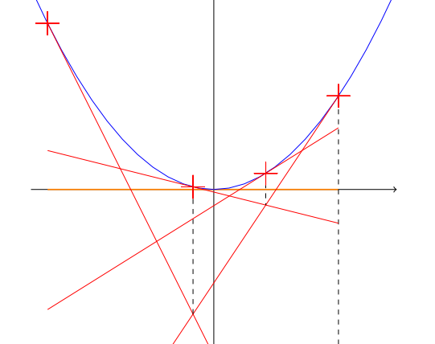

:orphan:  .. NOT DELETE: Avoid warning about document not being included in any toctree

SDDP
====

.. contents::
    :depth: 2
    :local:

General introduction
--------------------

SDDP stands for Stochastic Dynamic Dual Programming. It's a mathematical algorithm that allow to build an optimal strategy to face many possible future scenarios. The resulting optimal strategy can be applied in a second phase only, to one or several future scenarios. It is only this second phase that can be compared with a deterministic run. The explanations below only focus on the first phase which aims at building the optimal strategy. In Cactus, a scenario is a possible future demand for a given period.

Technical description and model assumptions
-------------------------------------------

Description of the SDDP Model
^^^^^^^^^^^^^^^^^^^^^^^^^^^^^

Introduction
~~~~~~~~~~~~

**Build an optimal strategy**

A SDDP run does not consist in optimizing a system directly (just like a deterministic run), but it rather aims at building iteratively an optimal strategy to face many possible future scenarios. In the literature, the optimal strategy can also be called "optimal policy". The resulting optimal strategy can be applied in a second phase only, to one or several future scenarios. It is only this second phase that can be compared with a deterministic run. The explanations below only focus on the first phase which aims at building the optimal strategy.

**Build a future cost function**

Building an optimal strategy consists in building one future cost function (also called "value function") per stochastic period (ie. period with an uncertain demand in the case of Cactus), that represents all the possible futures, and which depends on the state of the system at the end of this period (such as storages levels for example). This future cost function can be interpreted as the expected cost of the system considering all future possible scenarios. It is added to the objective value when optimizing each period.

For instance, let's say we are in January, and we need to optimize the use of one storage. If we know the cost function representing all the possible futures of the system after January (ie. expected future revenues for my storage) depending on the level at the end of the month, we can focus on the short term optimization of our storage within January month, by considering that the final level will bring us an expected revenue calculated by the cost function previously computed.

**State variables**

For a given period, the future costs/revenues depends only on several variables called state variables, that link current period to future periods together. In the example above, the state variable is the storage level: depending on the level of our storage at the end of January, we will not get the same revenue in the future. All the other variables chosen during the current period do not impact the future, and the future cost does not depend on them.
In Cactus, the state variables are described :ref:`here<target_state_variable_in_cactus>`.

**SDDP algorithm**

Theory tells us that these cost functions are convex. They are built using a stochastic dual dynamic program. This algorithm builds iteratively a lower approximation of the cost functions through linear tangents. See illustration below where:
    - A cost function is represented in blue, and depends on one state variable on the x-axis
    - Linear tangents are in red, are always lower than the cost function

NB. Note that for Cactus, the convex function is a piecewise linear function and not a continuous function as shown on this figure.

Red linear functions on the illustration above are tangents to the blue cost function at several points: the abscissa of these points correspond to different values/possibilities for the underlying state variable. The SDDP algorithm precisely aims at testing a lot of different values for the state variables, building for each of these trials a linear function of the state variables called a "cut". In the case above, there is only one state variable leading to one cut for each state variable value tested. When there are several state variables, the linear function built is a hyperplane tangent to the convex function at the point which ordinates are given by the combination of state variables values tested (you can think of a 2D plane in case there are two state variables).

One iteration results in building one cut, which is a linear lower approximation of the cost function. One iteration consists in two phases:
    1. A forward phase aiming at exploring the admissible domain of state variables ie. aiming at finding one new point to test along the future cost function of each period (remember that 1 period = 1 future cost function)
    2. A backward phase aiming at building a cut tangent to the future cost function for each point found during forward phase (ie. one cut for each period)

**1. Forward phase**

The forward phase aims at exploring points (ie. values) along the convex future cost function ie. at finding the red crosses on the illustration above. Ideally, if all points of the cost function are tested and if one cut is built for each of these tested points, we get a perfect approximation of the future cost. To explore the state variables admissible domain and thus the to test different points, we optimize the system period by period (beginning with the first one), by selecting one scenario randomly for each period, and by considering the future using the approximated future cost function built so far. It results in applying the optimal strategy computed so far to one (and only one) random scenario selected among all possible trajectories for the full horizon.

The values of the state variables obtained after solving one period give the initial state of the next period: initial value of state variables are fixed to these values through "Fixing constraints" in the next period. The forward phase can stop at the penultimate period as the objective is to propagate the state variables value from one period to the next ie. to initialize next period with results from previous period.

At first iteration, no approximation is available as no cut has been computed yet. Usually, this results in a "blind" strategy: considering the example above, when optimizing the first period, the storage is used at maximum as the stored gas is "free". For second period, we also use the stored gas at maximum, etc. until emptying the storage. For each period, the resulting storage level at the end of the period is saved.

At n-th iteration, n-1 cuts have been created for each period to approximate the future cost function. When optimizing the first period with one randomly selected scenario, these n-1 cuts "tell" your model that keeping a certain volume of stored gas at the end of this period can translate into a certain expected revenue: this expected revenue is given by the approximated future cost function.

For each iteration, once the first period has been solved with a randomly selected scenario, the second period is solved with a randomly selected scenario for this period, and so on, until solving the last remaining period of the horizon. Once this is done, the forward phase terminates, having created new points to explore into the state variables admissible domain.

**2. Backward phase**

The backward phase aims at building cuts tangent to the convex future cost function, to get an outer (ie. lower) approximation of it (remember that each period has its own future cost function). On the illustration above, the linear red lines are built by the backward phase. To do this, the algorithm focuses on the horizon periods sequentially, starting from the last period of the horizon. When dealing with a period, it aims at building a cut for the previous period. The backward phase thus stops once the second period is treated (ie. when a new cut is built for first period). Contrary to the first phase, all scenarios are considered when dealing with one period.

When considering a given period: the algorithm optimizes the system for all the possible scenarios (demand scenarios in Cactus) in parallel. If n scenarios are considered, n optimizations of the same period must be made, but with different input parameters (eg. demand). For each of these optimizations, the future cost function is considered in the objective, and the initial state of the system is fixed with results from the previous period solved in forward phase.

The marginal cost of corresponding "Fixing constraints" are obtained after solving each scenario. They translate the revenue (if negative) or the additional cost (if positive) that the system could get if it could increase the fixed initial state by 1 unit. For instance, in the example above, when we fix the initial storage level of a given period with such constraint, the corresponding marginal value tells us if one additional stored unit at the beginning of the period would have brought us some value. This information must be given to the previous period, so that when optimizing this previous period, the model knows that increasing the final value of state variables can decrease the cost of the next period.

As we get n marginal values for each constraint (for n scenarios), the average value gives us the expected marginal value of the constraint over all scenarios. This translated into the slope of the new cut to add to the future cost function of the previous period. The cut's intercept is obtained by subtracting the sumproduct of expected slopes and fixed state variables values (ie. RHS of "fixing constraints") from the total objective value.

Once slope and intercept are computed, the new cut is added to the approximated future cost function of the previous period, and the algorithm moves to the previous period to repeat the process and solve n scenarios once again. Note that the number of scenarios can vary from one period to another.

**3. Termination criterion**

The algorithm can stop at any time, but if it stops too early, the obtained strategy (aka policy) will not be optimal. A sufficient number of cuts should be created to get a more optimal policy. In Cactus, the number of iterations (= the number of cuts) can be chosen in the excel input file, through the options tab. See SDDP Options in the :ref:`Options<target_options>` tab.

In order to measure the convergence (and hence optimality of the obtained strategy), we can compare two quantities:
  1. The total objective of the first period solved during forward phase. It translates the cost of the system during first period + the cost of the system for all future periods approximated by a future cost function. This is a lower bound for the algorithm as the approximation of the future cost is a lower approximation. If the algorithm has converged, this total objective should be close to...
  2. ...the sum of the system costs for each period of the horizon (taken without cost of future). This sum can be interpreted as the cost of the system for the full horizon when applying the optimal strategy calculated so far. This is an upper bound for the system because as long as the algorithm has not converged, the strategy is not optimal and the resulting total cost is higher than the theoretical optimum.

The two quantities above are calculated during the forward phase. But during this phase, we only consider one scenario per period:
   - The lower bound described above thus varies a bit depending on the first period scenario randomly selected
   - The upper bound is also varying because the total cost depends on all scenarios randomly selected for each period of the horizon

Therefore, the lower bound and upper bound should not be directly compared, but one can compare their moving average value to get an idea of the convergence of the algorithm.

Practical implementation in Cactus
^^^^^^^^^^^^^^^^^^^^^^^^^^^^^^^^^^

Cactus Stochastic: SDDP application
~~~~~~~~~~~~~~~~~~~~~~~~~~~~~~~~~~~

**Stochastic horizon**

In Cactus Stochastic, the horizon is split into:
   - Stochastic periods, for which several demand scenarios exist;
   - Followed by deterministic periods (usually 12 periods of 1 month) with only one demand scenario, enabling to smooth the decisions at the end of the horizon. The deterministic part of the horizon can be modelled and optimized all at once.

**Future cost function**

The future cost function is approximated with outer linear functions of state variables, as described above.

In Cactus model, each linear function is indexed by a set `sddp_cut`. This set is initialized with as many members as the targeted number of cuts to create.

A parameter `active_sddp_cut` defined on this set tells the model if the corresponding cut is activated ie. has been computed yet, or not.

Each cut corresponds to a linear function defined with equation `CtrFutureCostFunction`. This equation states that the variable `FUTURE_COST`, representing the future cost of the system at a given period, must equal to a linear combination of:
- One intercept `sddp_intercept`
- State variables multiplied by the "averaged" marginal cost of their corresponding "fixing constraints" found when creating the given cut (See backward phase section :ref:`here<target_backward_phase>`). The averaged marginal costs parameters are all prefixed with `sddp_gradient`, followed by the name of the corresponding state variables.

.. _target_state_variable_in_cactus:
**State variables in Cactus**

In Cactus, the state variables are given in the table below with their description, the name of their associated GAMS variable, as well as the GAMS parameter and corresponding GAMS constraint used to fix these variables. All the state variables listed below have an impact on the future cost of the system when considering a given period in Cactus:

.. list-table:: State variables in Cactus
    :widths: 20 20 20 20 20
    :header-rows: 1

    * - State variable
      - Associated model variable
      - Associated model parameter
      - Associated fixing constraint
      - Comment
    * - Storages levels at the beginning of the horizon
      - qNiveauIni
      - NiveauIni
      - CtrFixedStockageNiveauHorizonIni
      - Needed for stationnarity constraint
    * - Storages levels
      - qNiveauCompteGaz
      - PrevNiveauCompteGaz
      - CtrPrevNiveauCompteGaz
      - 
    * - Regasification terminals levels at the beginning of the horizon
      - qTMNiveauIni
      - TMNiveauIni
      - CtrFixedTMNiveauHorizonIni
      - Needed for stationnarity constraint
    * - Regasification terminals levels
      - qTMNiveauEchoue
      - PrevTMNiveauEchoue
      - Liquefaction terminals are not handled by SDDP yet
      - 
    * - Cumulative quantity withdrawn from each supply contract
      - qApproCumul
      - PrevApproCumul
      - CtrFixedPrevApproCumul
      - Cumulative quantity withdrawn from each supply contract is subject to maximum ACQ (annual contract quantity) at the end of each year and maximum/minimum DCQ (daily contract quantities) on a daily basis
    * - Daily supply capacity booked
      - qDCQ
      - FixedApproDCQ
      - CtrFixedApproDCQ
      - 
    * - Quantity stored in regasification terminals: part corresponding to capacity already booked
      - qTMNiveauEchoue
      - PrevTMNiveauEchoue
      - CtrPrevTMNiveauEchoue
      - 
    * - Quantity stored in regasification terminals: part corresponding to annual additional capacity booked
      - qAddAnnee
      - PrevTMNiveauAddAnnee
      - CtrPrevTMNiveauAddAnnee
      - 
    * - Quantity stored in regasification terminals: part corresponding to periodic additional capacity booked
      - qAddPeriode
      - PrevTMNiveauAddAnnee
      - CtrPrevTMNiveauAddPeriode
      - 
    * - Annual capacity booked
      - kAddAnnee
      - FixedCapaAddAnnee
      - CtrFixedCapaAddAnnee
      - Defined for any type of capacity (transport, storage etc.)
    * - Quarterly capacity booked
      - kAddTrimestre
      - FixedCapaAddTrimestre
      - CtrFixedCapaAddTrimestre
      - Defined for any type of capacity (transport, storage etc.)

**SDDP Options**

See the :ref:`Options<target_options>` tab in the excel input file for the SDDP options available in Cactus. 

**SDDP in Python**

To manage the SDDP algorithm with Python, a class named `CactusSDDPOptim` has been created in the script *couches/sddp/cactus_sddp_optim.py*. This class aims at managing the data workflow all along the algorithm process. It uses the GUSS facility in GAMS (see `the description here <https://www.gams.com/mccarlGuide/guss.htm>`_). The idea behind GUSS facility is to run a same optimization, by changing only several parameters. In the SDDP algorithm, we always run the same optimization made of one unique period that can vary, and thus with varying parameters for the model. Indeed, all the parameters depending on time will vary depending on the considered period, and demand parameter will also vary depending on the scenario considered.

The main method of this class is the `SDDP_run` method, launching all the steps of the algorithm.

**1. GAMS checkpoints**

A first step is to create several GAMSCheckpoints. A GAMSCheckpoint is an object that captures the state of a model after the solve: another run can restart (or continue) from a GAMSCheckpoint. A GAMSCheckpoint also records the basic solution of the initial run, enabling for faster results if a similar run is launched from this checkpoint. In our case, we will iteratively run several optimizations with almost the same parameters.

In Cactus, we must handle 2 or 3 types of optimizations requiring one GAMSCheckpoint each:
   - optimizations over one monthly period (for all periods considered as stochastic)
   - optimizations over several deterministic periods at once (the end of the horizon is usually deterministic and solved in one block)
   - optimizations over one peak period (optional)

The GAMS checkpoints are created through the sub-method called `initialize_basescen_database`. Once created, any run during the SDDP process will restart from one of these checkpoints to save time.

**2. GAMS workers/processes**

During the backward phase of the algorithm (See :ref:`backward phase<target_backward_phase>` for details), optimizations of the same horizon with different demand scenarios can be run in parallel. Multiprocessing is thus used to solve the models in parallel. To do this, a class called `CactusProcess` has been created in the script *couches/sddp/cactus_process.py*. This object is a child of the object Process from the Python library "multiprocessing". It aims at creating open processes, that are:

  - Waiting for jobs
  - Picking a job whenever there is one in a given queue
  - Solving the underlying model
  - Postprocessing results
  - Sending information to the main process

These workers are initialized in the sub-method called `initialize_workers` with one (and only one) GAMSCheckpoint. It means that each process is "specialized" in solving on type of optimization only.

**3. Data communication between main processes and workers**

To communicate data between the main process and the Cactus processes, we use an object called Manager from multiprocessing python library. We can link to this Manager several objects (mostly queues and dictionaries), that can be modified by each process. The Manager is handling all possible communication conflicts between processes and these objects: it makes sure that two processes are not modifying the same object at the same time. All these objects are initialized when instantiating a CactusSDDPOptim object.

Two of these shared dictionaries called `shared_sddp_db` and `cuts_results_db` are used to communicate the information on new cuts (ie. all parameters values created during the SDDP progress) between all workers. In `shared_sddp_db`, one will find all the cuts computed / created, and in `cuts_results_db`, one will find all the raw results of jobs, used to compute the final cuts feeding `shared_sddp_db`.

  - self.computed_sddp_cuts = self.manager.dict()
  - self.bounds = self.manager.dict()
  - self.variables_results_db = self.manager.dict()

**4. Forward phase**

Once workers are ready, the sub-method `send_forward_phase_runs_to_workers` creates the jobs to send to these workers. In this method, we iterate on the horizon periods, from the first one to the penultimate one. Indeed, the last period of horizon (made of deterministic periods) is not optimized in the forward phase, as the latter only aims at calculating initial state of the next period.

For each of these periods, we randomly choose a demand scenario. We gather the information of the underlying optimization to be run in a job, and we add it to a queue linked to the multiprocessing Manager, called run_queue_mono_period (for monthly periods) or run_queue_monopeak_period (for peak periods). The workers that were waiting can now pick jobs in these queues and run them.

Note that a dictionary called `computed_forward_periods` is created and indexed by stochastic period to follow the progress of the forward phase. Once a job is treated by a worker, the worker send a signal to complete this dictionary.

.. _target_backward_phase:
**5. Backward phase**

*i. Create jobs ie. optimizations to be run*

The backward phase is handled through the method called `send_backward_phase_runs_to_workers`. First, the algorithm waits for forward phase termination, by examining `computed_forward_periods` dictionary. Once forward phase ends, we iterate on periods from the latter (the deterministic part of horizon) to the second period, in a reverse order. Note that the first period is not treated as the backward phase aims at building a new cut for the previous period.

For each of these periods, we loop on all demand scenarios and create one job per tuple (period, scenario). We add it to a queue linked to the multiprocessing Manager, called run_queue_mono_period (for monthly periods) or run_queue_monopeak_period (for peak periods). The workers that were waiting can now pick these jobs in these queues and run them.

Similarly to the forward phase, a dictionary called `computed_backward_periods` indexed by period is used to follow the progress of this phase.

*ii. Cut generation*

In the same backward phase, for each period considered sequentially (starting with the last one), we wait for all jobs associated to this period to be finished before computing the new cut for the previous period. To check if all runs have terminated, we check that the number of jobs done for the given period equals the number of scenarios to be run for this period. Then the class method `generate_sddp_cuts` is used to generate the cut.

  - It first activates the new cut by feeding the GAMS parameter **active_sddp_cut**
  - Then, the raw results from jobs are read in the shared dictionary `cuts_results_db`, and the sumproduct of these results with their linked likelihood is made
  - The results give the averaged parameters of the new cut, which is added to the `shared_sddp_db` for the previous period.

Note that the cut generation must be done before running jobs of the previous period (the next jobs to be run by the workers). A shared dictionary `computed_sddp_cuts`, indexed by SDDP iteration considered and periods, is used to make workers wait for the cut to be generated before resuming work.

Excel input sheets
------------------

.. _target_scenario_demand_coeff:
.. admonition:: ScenarioDemandCoeff
    :class: error

    *Sheet description*: 

    .. list-table::
        :widths: 25 25 25 25 25
        :header-rows: 1

        * - Periode	
          - Probabilite
          - Zone1
          - Zone2
          - ...
        * - Period (eg: 01/04/2021)
          - Probability (eg: 0.3)
          - EU (eg: 1.05)
          - FR (eg: 0.95)
          - ...

    *Mandatory sheet*: ❌ (mandatory if the model is stochastic)

.. _scenario_demand_coeff:

    ⚙️ Period
        * *Description:* The period for which the demand scenario is defined.
        * *Default value:* *None*
        * *Default unit:* *None*
        * *Validity:* Date. The periods must be defined in the :ref:`Horizon<target_periods>` sheet.

    ⚙️ Probability
        * *Description:* The probability of the demand scenario.
        * *Default value:* *None*
        * *Default unit:* *None*
        * *Validity:* Float. The sum of all probabilities for a given period must be equal to 1.

    ⚙️ Zone1, Zone2, ...
        * *Description:* The demand coefficient for each zone.
        * *Default value:* *None*
        * *Default unit:* *None*
        * *Validity:* Float. The zones must be defined in the :ref:`Zones<target_zones>` sheet.